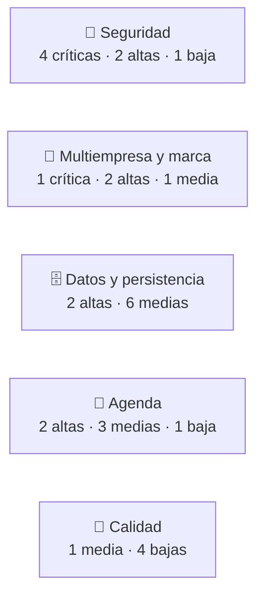

# 01 · Visión y alcance

> **Estado:** ✅ Aprobado el 2026-09-25.

## Diagnóstico de v1 (Maison Lash)

> **Alcance de la revisión:** análisis del código del commit `787d07a` (13 archivos, ~4.100 líneas de HTML, CSS y JS).
> **No revisado:** la configuración del panel de Supabase (RLS, políticas, esquema real), que no está en el repositorio. Los hallazgos que dependen de ella se marcan *"a verificar"*.

### Resumen ejecutivo

La v1 **funciona como demo** de una sola marca, pero **no es apta para producción ni para varias empresas**. Hay tres bloqueos de fondo:

1. **Seguridad:** la sesión se puede falsificar desde el navegador y las contraseñas viajan y se guardan en texto plano.
2. **Multiempresa:** no existe el concepto de empresa. Todo el modelo supone un único negocio.
3. **Persistencia:** el navegador es la fuente de verdad y Supabase una copia. Eso provoca datos perdidos, datos que reaparecen y reservas duplicadas.

| Severidad | Cantidad | Criterio |
|---|---|---|
| 🔴 Crítica | 5 | Permite suplantar usuarios, exponer datos personales o bloquea por completo el objetivo multiempresa |
| 🟠 Alta | 8 | Pérdida o corrupción de datos, o impide ofrecer la app a otro tipo de negocio |
| 🟡 Media | 11 | Error funcional visible para el usuario o deuda que encarece el desarrollo |
| ⚪ Baja | 6 | Mantenibilidad y buenas prácticas |
| **Total** | **30** | |

### Hallazgos

Cada hallazgo tiene un ID (se usa en el plan y en los PR), evidencia comprobable en el código y el flujo v2 que lo resuelve.

#### 🔐 Seguridad

| ID | Hallazgo | Evidencia | Impacto | Sev. | Se resuelve en |
|---|---|---|---|---|---|
| S-01 | **La sesión se puede falsificar.** El rol se lee de `localStorage` sin ninguna verificación | `compartido/js/auth.js:90`, `:111` | Con `localStorage.setItem('maisonlash_session','{"role":"boss"}')` en la consola, cualquiera abre el panel del jefe | 🔴 | [03](03-roles-y-permisos.md), [06](06-flujo-acceso-y-empresa.md) |
| S-02 | **Contraseñas en texto plano** en `clients` y `employees`: el navegador las descarga para validar el login y las sube a Supabase | `auth.js` (`getAllUsers`, `login`), `data-store.js` (`upsertClient`, `upsertEmployee`) | Cualquiera con acceso a los datos obtiene las credenciales de todos los clientes y empleados | 🔴 | [04](04-modelo-de-datos.md), [06](06-flujo-acceso-y-empresa.md) |
| S-03 | **Credenciales fijas en el código:** `jefe/jefe123`, `admin/admin123`, `usuario/user123` | `auth.js:10` | El código es público en el navegador: acceso de jefe para cualquiera que lo lea | 🔴 | [06](06-flujo-acceso-y-empresa.md), [14](14-migracion-maison-lash.md) |
| S-04 | **Supabase se usa sin sesión.** La app lee y escribe todas las tablas solo con la clave pública; la protección depende al 100 % de RLS en el panel, que no está versionado *(a verificar)* | `data-store.js:8`, `syncFromSupabase`, `syncUpsert` | Si RLS no está activo, cualquiera puede leer, modificar o borrar todos los datos desde fuera de la app | 🔴 | [04](04-modelo-de-datos.md), [05](05-seguridad.md) |
| S-05 | **Contraseñas por defecto** asignadas en silencio: un cliente sin clave queda con `user123` y un empleado con `empleado123` | `data-store.js:342`, `:367` | Cuentas con contraseñas conocidas por cualquiera | 🟠 | [06](06-flujo-acceso-y-empresa.md) |
| S-06 | **Un cliente puede ver citas ajenas:** las citas se asocian por celular además de por correo, y si no se encuentra el cliente se usa el primero de la lista | `usuarios/js/usuarios.js:106`, `:99` | Filtración de datos personales entre clientes | 🟠 | [04](04-modelo-de-datos.md) (RLS por `cliente_id`) |
| S-07 | Dependencia `supabase-js@2` sin versión exacta ni verificación de integridad | `index.html:58` (y los otros 3 HTML) | Una actualización del CDN puede romper la app sin cambios propios | ⚪ | [02](02-arquitectura.md#adr-003) |

#### 🏢 Multiempresa y marca

| ID | Hallazgo | Evidencia | Impacto | Sev. | Se resuelve en |
|---|---|---|---|---|---|
| M-01 | **No existe `empresa_id`.** Un único conjunto global de servicios, clientes, empleados y citas | `data-store.js` (`STORAGE_KEYS`, todas las tablas) | Imposible alojar una segunda empresa sin mezclar datos: **bloqueante** para CristaSpa | 🔴 | [04](04-modelo-de-datos.md) |
| M-02 | **Marca fija en el código:** 196 referencias a "Maison Lash" en 13 archivos, incluido `wrangler.toml` | `grep -ri "maison\|lash"` | Cada empresa nueva exigiría copiar y editar el proyecto | 🟠 | [07](07-marca-dinamica.md) |
| M-03 | **Categorías fijas** (pestañas, cejas, labios) en la lógica, en los estilos y en los formularios | `compartido/js/ui.js:87`, `:106`; `<select>` de `jefe/html/index.html` | Un spa de masajes, una barbería o un salón de uñas no encajan | 🟠 | [04](04-modelo-de-datos.md), [09](09-modulo-jefe.md) |
| M-04 | Colores nombrados por su tono (`--teal`, `--gold`) y no por su función | `compartido/css/base.css:7-31` | No se pueden reemplazar por la paleta de otra empresa de forma coherente | 🟡 | [07](07-marca-dinamica.md) |

#### 🗄️ Datos y persistencia

| ID | Hallazgo | Evidencia | Impacto | Sev. | Se resuelve en |
|---|---|---|---|---|---|
| D-01 | **`localStorage` es la fuente de verdad:** en cada guardado se sube la tabla completa desde el navegador | `data-store.js:160` (`saveAll`) y `saveServices`, `saveAppointments`… | Tráfico que crece con los datos, y un dispositivo con datos viejos puede **revivir registros borrados** desde otro | 🟠 | [02](02-arquitectura.md#adr-004) |
| D-02 | **Errores de guardado silenciosos:** las escrituras no se esperan y los fallos solo van a la consola | `data-store.js:227-230` | El usuario ve "Guardado" aunque el dato nunca llegó a la base | 🟠 | [02](02-arquitectura.md#capas-y-responsabilidades) |
| D-03 | Si una tabla de Supabase está vacía, la app **reinstala los datos de ejemplo** | `data-store.js:293`, `:779` | Borrar todos los servicios los hace reaparecer | 🟡 | [04](04-modelo-de-datos.md) |
| D-04 | Precio guardado como texto (`"$80.000"`) | `DEFAULT_SERVICES`, `upsertService` | No se pueden sumar ingresos ni cambiar la moneda | 🟡 | [04](04-modelo-de-datos.md) |
| D-05 | Imágenes en base64 dentro de las filas | `ui.js:126` (`readImageInput`) | Filas de cientos de KB y sincronizaciones lentas en el celular | 🟡 | [04](04-modelo-de-datos.md#almacenamiento) |
| D-06 | Relaciones como arreglos dentro de las filas (`serviceIds`, `serviceNames` duplicados), ids de texto y sin llaves foráneas | `migrateEmployees`, `migrateAppointments` | Datos inconsistentes al renombrar o borrar servicios; ids que chocarían entre empresas | 🟡 | [04](04-modelo-de-datos.md) |
| D-07 | El jefe **borra citas físicamente**, sin historial ni auditoría | `jefe/js/jefe.js:513` | Se pierden datos para reportes y no hay trazabilidad | 🟡 | [08](08-flujo-citas.md), [09](09-modulo-jefe.md) |
| D-08 | El esquema de Supabase no está versionado en el repositorio | No existe la carpeta `supabase/` | Nadie puede reproducir ni revisar la base; los cambios se hacen a mano | 🟡 | [02](02-arquitectura.md), [15](15-plan-de-implementacion.md) |

#### 📅 Agenda

| ID | Hallazgo | Evidencia | Impacto | Sev. | Se resuelve en |
|---|---|---|---|---|---|
| A-01 | **Doble reserva posible:** el choque de horario se valida solo en el navegador con datos locales | `data-store.js:709` (`isSlotTaken`), `usuarios.js:314`, `jefe.js:374` | Dos clientes reservan el mismo horario con el mismo especialista | 🟠 | [08](08-flujo-citas.md#reserva-segura-concurrencia) |
| A-02 | **Horarios fijos** (09–11 y 14–17) y citas siempre de 1 h, sin importar el servicio | `data-store.js` (`getTimeSlots`) | Servicios de 2 h se cruzan con la siguiente cita; no sirve para otros horarios de negocio | 🟠 | [04](04-modelo-de-datos.md), [08](08-flujo-citas.md) |
| A-03 | "Hoy" y las fechas se calculan en UTC | `data-store.js:264`, `:746` (`toISOString`) | Desde las 7 p. m. en Colombia, la agenda muestra el día siguiente | 🟡 | [08](08-flujo-citas.md) |
| A-04 | Se pueden reservar **horas que ya pasaron** en el día actual | `usuarios.js:279` (no filtra por la hora actual) | Citas imposibles de cumplir | 🟡 | [08](08-flujo-citas.md#cálculo-de-disponibilidad) |
| A-05 | Al eliminar un empleado, sus citas quedan sin asignar **sin avisar a nadie** | `data-store.js:636` | Clientes con cita que nadie va a atender | 🟡 | [09](09-modulo-jefe.md) |
| A-06 | Si ningún especialista ofrece el servicio, se muestran **todos** | `usuarios.js:238` | Se asigna un servicio a quien no lo sabe hacer | ⚪ | [08](08-flujo-citas.md) |

#### 🧰 Calidad y mantenibilidad

| ID | Hallazgo | Evidencia | Impacto | Sev. | Se resuelve en |
|---|---|---|---|---|---|
| C-01 | Sin pruebas automáticas ni integración continua | Repositorio | Cada cambio puede romper algo sin que nadie lo note | 🟡 | [15](15-plan-de-implementacion.md) |
| C-02 | Código en variables globales (`window.MaisonStore`…) y nombres mezclados (`nombre`/`name`, `correo`/`email`) | `data-store.js`, `auth.js` | Más difícil de entender y de ampliar | ⚪ | [02](02-arquitectura.md#adr-003) |
| C-03 | El README describe solo `localStorage` y no menciona Supabase | `README.md` | Documentación engañosa para quien llegue al proyecto | ⚪ | [15](15-plan-de-implementacion.md) |
| C-04 | Estilos en línea (`style="…"`) en el HTML | 3 casos, p. ej. `jefe/html/index.html` | Impiden una política CSP estricta | ⚪ | [05](05-seguridad.md) |
| C-05 | Tiempo real sin escuchar la tabla `clients` | `data-store.js:803` | Cambios de clientes no se reflejan en otros dispositivos | ⚪ | [08](08-flujo-citas.md#tiempo-real) |

### Lo que se conserva de v1

No todo se rehace. Estas bases están bien resueltas y se reutilizan:

| Fortaleza | Dónde | Cómo se aprovecha en v2 |
|---|---|---|
| Separación por rol en carpetas (`usuarios/`, `jefe/`, `empleado/`, `compartido/`) | Estructura del repo | Se mantiene y se agrega `desarrollador/` |
| Escape de HTML consistente (`escapeHTML`, `escapeAttr`) | `ui.js` | Base de la protección contra XSS |
| Diseño móvil con variables CSS | `base.css` | Solo se renombran los tokens por función |
| Funciones pequeñas con JSDoc y nombres claros | Todo el JS | Se pasan casi tal cual a módulos ES |
| Normalización de datos antiguos (`migrate*`) | `data-store.js` | Sirve de guía para el script de migración ([14](14-migracion-maison-lash.md)) |
| Confirmación por WhatsApp | `usuarios.js` | Se mantiene, con plantilla configurable |
| Despliegue estático en Cloudflare | `wrangler.toml` | Se mantiene |

### Acciones inmediatas, antes de v2

Mientras v2 se construye, la v1 sigue en línea con riesgos 🔴. Se recomienda:

1. **Verificar RLS** en las tablas v1 del panel de Supabase (S-04). Si están abiertas, tratar las contraseñas actuales como expuestas.
2. **No difundir la URL de la demo** mientras existan las credenciales fijas (S-03) y la sesión falsificable (S-01).
3. **No cargar datos reales nuevos** en v1: todo lo nuevo entra ya por v2.

## Visión (v2 — CristaSpa)

> Una plataforma de reservas y gestión para negocios de belleza y bienestar, donde **cada empresa entra con su propio enlace, ve solo sus datos y luce su propia marca**, y el equipo CristaSpa puede **dar de alta una empresa nueva en minutos** desde un panel de desarrollador.

## Objetivos

1. **Multiempresa real:** aislamiento de datos por `empresa_id`, garantizado en la base de datos y no solo en la interfaz.
2. **Marca genérica CristaSpa** con personalización por empresa (nombre, logo, colores).
3. **Módulo desarrollador** visible solo para el rol `developer`.
4. **Onboarding de empresas** autogestionado desde el módulo desarrollador.
5. **Autenticación segura** con Supabase Auth y sin contraseñas en tablas.
6. **Configuración de negocio flexible:** categorías, horarios, duración y precio numérico.
7. **Migrar Maison Lash** como la primera empresa, sin perder datos.

## Alcance (incluido)

- Todo lo que hoy hacen los módulos usuario, jefe y empleado, adaptado a multiempresa.
- El nuevo módulo desarrollador ([12](12-modulo-desarrollador.md)).
- Invitación de jefes y empleados por correo.
- Recuperación de contraseña.
- Estados de empresa: prueba, activa, suspendida, eliminada.
- Auditoría de acciones sensibles.
- Pruebas automáticas de aislamiento entre empresas.
- Entornos de desarrollo y producción separados.

## Fuera de alcance (v2)

Se dejan documentados para una versión posterior:

- Cobro y facturación de suscripciones (pasarela de pago).
- Pagos de citas en línea.
- App nativa (la v2 sigue siendo una web móvil, que puede instalarse como PWA más adelante).
- Varias sedes por empresa (el modelo deja espacio para agregar `sede_id` después).
- Notificaciones automáticas por WhatsApp Business API (se mantiene el enlace `wa.me`).
- Dominios propios por empresa (`reservas.miempresa.com`).

## Supuestos

- Hosting estático en Cloudflare, igual que hoy (`wrangler.toml`).
- Un solo proyecto Supabase por entorno (dev y prod).
- Zona horaria por defecto `America/Bogota` y moneda por defecto `COP`, ambas configurables por empresa.
- Idioma de la interfaz: español.

## Métricas de éxito

| Métrica | Meta |
|---|---|
| Tiempo para dar de alta una empresa nueva | < 5 minutos desde el módulo desarrollador |
| Fugas de datos entre empresas en las pruebas de aislamiento | 0 |
| Contraseñas almacenadas en tablas propias | 0 |
| Referencias a "Maison Lash" fijas en el código | 0 (solo como datos de la empresa migrada) |
| Datos de Maison Lash perdidos en la migración | 0 filas |

---

[Índice](README.md) · [02 · Arquitectura](02-arquitectura.md) →
