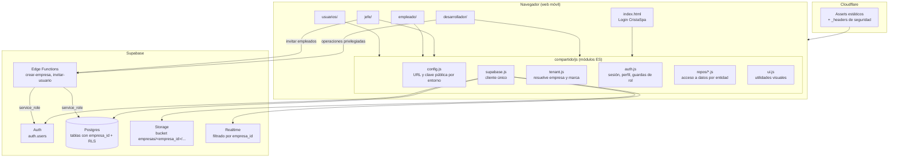

# 02 · Arquitectura

> **Estado:** ✅ Aprobado el 2026-09-25 · Decisiones D1, D4 y D8 aprobadas · Entorno dev: Supabase en la nube.

## Vista general



## Decisiones de arquitectura (ADR)

### ADR-001

**Decisión:** Multiempresa en una sola base de datos con `empresa_id` y RLS

- **Contexto:** se necesita que cada empresa tenga "su propia base de datos" y que el ingreso de empresas nuevas sea rápido.
- **Decisión:** un proyecto Supabase por entorno. Todas las tablas de negocio llevan `empresa_id uuid not null`. Postgres, mediante RLS, solo devuelve las filas de la empresa del usuario autenticado.
- **Consecuencias:**
  - ✅ Dar de alta una empresa es un `INSERT` y no requiere crear infraestructura.
  - ✅ Una sola migración de esquema sirve para todas las empresas.
  - ✅ El módulo desarrollador puede consultar todas las empresas con una sola conexión.
  - ⚠️ El aislamiento depende de que las políticas RLS sean correctas, por eso hay pruebas automáticas obligatorias ([15](15-plan-de-implementacion.md#pruebas)).
  - 🔁 Salida futura: si una empresa exige aislamiento físico, sus filas se exportan a un proyecto dedicado sin cambiar el esquema.

### ADR-002

**Decisión:** Identificación de la empresa por slug en la URL

- Fase 1: `https://cristaspa.app/?empresa=maison-lash`. Funciona hoy en Cloudflare sin configurar DNS.
- Fase 2: `https://maison-lash.cristaspa.app` con DNS comodín (`*.cristaspa.app`). `tenant.js` ya soporta ambas formas.
- La empresa resuelta se guarda en `sessionStorage`, así las páginas internas no dependen del parámetro.
- La empresa **nunca se confía desde la URL para dar permisos**. Solo decide qué marca mostrar. El permiso real sale del `perfil.empresa_id` en la base de datos.

### ADR-003

**Decisión:** HTML/CSS/JS sin framework, con módulos ES

- Se conserva la base actual para reducir riesgo y tiempo.
- Se pasa de scripts globales (`window.MaisonStore`) a `import`/`export` con `<script type="module">`.
- `supabase-js` se importa desde `https://cdn.jsdelivr.net/npm/@supabase/supabase-js@2/+esm` con versión fijada.
- No hay paso de compilación. Si el proyecto crece, migrar a Vite es directo porque el código ya estará en módulos.

### ADR-004

**Decisión:** Supabase como fuente de verdad

- Hoy: `localStorage` primero y luego se suben *todas* las filas de la tabla en cada guardado.
- v2: cada acción escribe **solo la fila afectada** en Supabase y espera la respuesta (con manejo de error visible para el usuario).
- Las lecturas se piden por pantalla y con filtros (por ejemplo, las citas de la semana visible).
- Realtime se suscribe con `filter: empresa_id=eq.{id}` para refrescar la vista.
- `localStorage` guarda solo la sesión de Supabase (lo maneja `supabase-js`) y preferencias de interfaz.

### ADR-005

**Decisión:** Operaciones privilegiadas solo en Edge Functions

Crear empresas, invitar usuarios y cambiar el estado de una empresa requieren la `service_role` key. Esa clave **vive solo en las Edge Functions**. El navegador llama a la función con el JWT del usuario y la función verifica el rol antes de actuar.

## Estructura de carpetas propuesta

```text
/
├── index.html                      Login y registro CristaSpa (marca dinámica)
├── _headers                        Cabeceras de seguridad Cloudflare (CSP, etc.)
├── wrangler.toml                   name = "cristaspa"
├── assets/
│   └── marca/                      Logo e íconos CristaSpa por defecto
├── compartido/
│   ├── css/base.css                Tokens de diseño como variables (--brand-*)
│   └── js/
│       ├── config.js               Entorno: SUPABASE_URL, SUPABASE_ANON_KEY
│       ├── supabase.js             createClient único
│       ├── tenant.js               slug → empresa pública → aplicar marca
│       ├── auth.js                 login, registro, logout, requireRole, perfil
│       ├── fechas.js               "hoy" en la zona horaria de la empresa
│       ├── ui.js                   toast, escape, formato de moneda, CSV
│       └── repos/
│           ├── empresas.js
│           ├── categorias.js
│           ├── servicios.js
│           ├── productos.js
│           ├── clientes.js
│           ├── empleados.js
│           ├── citas.js
│           ├── horarios.js
│           └── config-empresa.js
├── desarrollador/                  NUEVO — solo el rol developer
│   ├── html/index.html
│   ├── css/desarrollador.css
│   └── js/desarrollador.js
├── jefe/        html/ css/ js/
├── empleado/    html/ css/ js/
├── usuarios/    html/ css/ js/
├── supabase/
│   ├── config.toml
│   ├── migrations/                 SQL versionado (esquema, RLS, funciones)
│   └── functions/
│       ├── crear-empresa/
│       └── invitar-usuario/
├── scripts/
│   └── check-secrets.mjs           Falla si hay claves privilegiadas en el repo
├── tests/
│   ├── db/                         Esquema, RLS y reglas de negocio (PGlite)
│   └── e2e/                        Pruebas de flujos (Playwright)
└── docs/flujos/                    Estos documentos
```

Se eliminan `CSS/styles.css` y `JavaScript/app.js`: su contenido pasa a `compartido/` y a un `login.js` junto a `index.html`, para que todo quede con la misma convención.

## Capas y responsabilidades

| Capa | Responsabilidad | No debe |
|---|---|---|
| Páginas (`*/js/*.js`) | Pintar la vista y responder a eventos | Llamar a Supabase directamente |
| `repos/*.js` | Una función por operación (`listarCitas`, `crearCita`…), agregar `empresa_id`, traducir errores | Tocar el DOM |
| `auth.js` / `tenant.js` | Contexto de sesión: usuario, rol, empresa activa | Guardar contraseñas |
| Postgres + RLS | Reglas de acceso e integridad (FK, choques de horario, estados) | Confiar en lo que envía el cliente |
| Edge Functions | Operaciones con privilegios elevados | Exponer la `service_role` |

## Entornos

| Entorno | Supabase | Cloudflare | Uso |
|---|---|---|---|
| **dev** | Proyecto en la nube `cristaspa-dev` (plan gratuito) | Preview por rama | Desarrollo y QA, con datos de `seed.sql` |
| **prod** | Proyecto `cristaspa-prod` | `cristaspa.app` | Empresas reales |

- Las migraciones se aplican con `npx supabase db push`: primero en dev y, cuando pasan las pruebas, en prod.
- **Decisión (2026-09-25):** dev en la nube y no local, porque el equipo no tiene Docker instalado. La CLI de Supabase se usa con `npx` (Node 25 ya instalado), sin instalar nada más. Las pruebas del esquema (RLS, aislamiento y reglas de negocio) corren **sin Docker** con PGlite (Postgres real compilado a WASM) y `node --test`, en local y en CI: `npm test`. Además, el CI levanta un Supabase efímero (GitHub Actions sí tiene Docker) para aplicar las migraciones reales y pasar `supabase db lint`.
- `config.js` elige el entorno según el dominio, así la clave pública correcta se usa sin tocar código.

---

← [01 · Visión y alcance](01-vision-y-alcance.md) · [Índice](README.md) · [03 · Roles y permisos](03-roles-y-permisos.md) →
