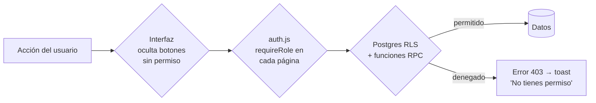

# 03 · Roles y permisos

> **Estado:** ✅ Aprobado el 2026-09-25 · Decisiones de negocio: el jefe puede invitar a otro jefe · el empleado no agenda citas · el empleado no ve precios salvo que la empresa lo active · se agrega el rol `receptionist`.

## Roles

| Rol | Alcance | Cómo se obtiene | Pantalla de inicio |
|---|---|---|---|
| `developer` | **Global:** todas las empresas | `perfiles.es_developer = true`, asignado solo por otro developer o por SQL | `desarrollador/` |
| `boss` | Una empresa, todo | Invitación del developer (onboarding) o de otro jefe de la misma empresa | `jefe/` |
| `receptionist` | Una empresa: agenda y clientes de todos | Invitación del jefe | `jefe/` en **modo recepción** (solo las pestañas Agenda y Clientes) |
| `employee` | Una empresa, solo sus citas | Invitación del jefe | `empleado/` |
| `user` | Una empresa, solo sus datos | Registro propio con el enlace de la empresa, o invitación del jefe | `usuarios/` |

Una persona puede tener **roles distintos en empresas distintas** (por ejemplo, empleada en el spa A y clienta del spa B). En cada empresa el rol lo decide la membresía.

## Matriz de permisos

✅ permitido · 👁 solo lectura · 🔸 limitado (ver nota) · ❌ sin acceso

| Recurso / acción | developer | boss | receptionist | employee | user |
|---|---|---|---|---|---|
| **Empresas:** listar todas | ✅ | ❌ | ❌ | ❌ | ❌ |
| Crear empresa | ✅ | ❌ | ❌ | ❌ | ❌ |
| Suspender / activar / eliminar empresa | ✅ | ❌ | ❌ | ❌ | ❌ |
| Editar marca de la empresa (logo, colores) | ✅ | ✅ | ❌ | ❌ | ❌ |
| Ver como empresa (soporte) | ✅ ¹ | ❌ | ❌ | ❌ | ❌ |
| **Configuración** (WhatsApp, redes, reglas de agenda) | ✅ | ✅ | 👁 | 👁 | 🔸 ² |
| **Categorías / servicios / productos** | ✅ | ✅ | 👁 | 👁 ⁴ | 👁 (solo activos) |
| **Horarios de atención** | ✅ | ✅ | 👁 | 👁 | 👁 |
| Bloqueos de agenda | ✅ | ✅ | ✅ | 🔸 (los propios) | ❌ |
| **Equipo:** invitar empleados y recepcionistas | ✅ | ✅ | ❌ | ❌ | ❌ |
| Invitar a otro jefe de la misma empresa | ✅ | ✅ | ❌ | ❌ | ❌ |
| Ver empleados | ✅ | ✅ | ✅ | ✅ | 🔸 (nombre, cargo, foto) |
| **Clientes:** ver / crear / editar | ✅ | ✅ | ✅ | 🔸 ver los de sus citas | ❌ |
| Notas internas del cliente | ✅ | ✅ | ✅ | ❌ | ❌ |
| Exportar clientes (CSV) | ✅ | ✅ | ❌ | ❌ | ❌ |
| Editar el propio perfil | ✅ | ✅ | ✅ | ✅ | ✅ |
| **Citas:** ver | ✅ | ✅ todas | ✅ todas | 🔸 las asignadas | 🔸 las propias |
| Crear cita | ✅ | ✅ para cualquier cliente | ✅ para cualquier cliente | ❌ | 🔸 para sí mismo |
| Confirmar | ✅ | ✅ | ✅ | ❌ | ❌ |
| Completar / no asistió | ✅ | ✅ | ✅ | 🔸 sus citas | ❌ |
| Cancelar | ✅ | ✅ | ✅ | ❌ | 🔸 las propias, dentro del límite de horas |
| Reprogramar | ✅ | ✅ | ✅ | ❌ | 🔸 si la empresa lo permite |
| Borrar definitivamente | ✅ | ❌ ³ | ❌ | ❌ | ❌ |
| Ver precios y totales de las citas | ✅ | ✅ | ✅ | 🔸 ⁴ | ✅ (los propios) |
| **Reportes y CSV** | ✅ | ✅ | ❌ | ❌ | ❌ |
| **Auditoría** | ✅ todas | 👁 la de su empresa | ❌ | ❌ | ❌ |
| Gestionar desarrolladores | ✅ | ❌ | ❌ | ❌ | ❌ |

1. Por defecto en **solo lectura**. Cada entrada queda registrada en `auditoria` (`ver_como_empresa`).
2. El usuario solo ve el WhatsApp y las redes activas.
3. En v2 el jefe **cancela** en lugar de borrar, para conservar el historial. Hoy existe el botón "Borrar", que se reemplaza por "Cancelar".
4. Los precios se ocultan al empleado salvo que la empresa active `empresa_config.empleado_ve_precios`. En la base de datos se hace con la vista `citas_empleado`, que devuelve `total = null` cuando está desactivado.

### Grupos de roles usados en las políticas

Para no repetir listas en cada política SQL, se usan estos grupos:

| Grupo | Roles | Uso |
|---|---|---|
| `ADMIN` | `boss` | Configuración, catálogo, equipo, reportes |
| `AGENDA` | `boss`, `receptionist` | Citas y clientes de toda la empresa |
| `EQUIPO` | `boss`, `receptionist`, `employee` | Lectura interna (catálogo, empleados, horarios) |
| `TODOS` | `boss`, `receptionist`, `employee`, `user` | Lectura pública dentro de la empresa |

## Dónde se hacen cumplir los permisos

| Capa | Función | ¿Suficiente sola? |
|---|---|---|
| Interfaz | Experiencia: no mostrar lo que no se puede hacer | ❌ Se puede saltar desde la consola del navegador |
| `requireRole` | Redirigir a la pantalla correcta | ❌ Igual que la anterior |
| **RLS + RPC** | **Seguridad real** | ✅ Es la única barrera en la que se confía |
| Edge Functions | Operaciones con `service_role` | ✅ Verifican el JWT y el rol antes de actuar |

**Regla del proyecto:** cualquier permiso nuevo se implementa **primero en RLS o RPC, con su prueba**, y después en la interfaz.

---

← [02 · Arquitectura](02-arquitectura.md) · [Índice](README.md) · [04 · Modelo de datos](04-modelo-de-datos.md) →
