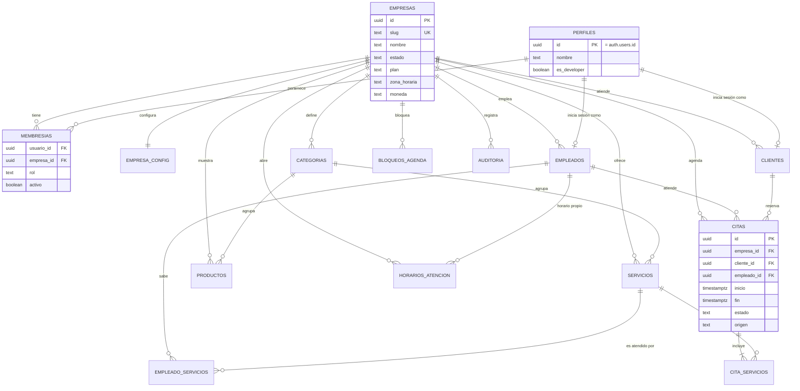

# 04 · Modelo de datos

> **Estado:** ✅ Aprobado el 2026-09-25.

## Principios

1. **Toda tabla de negocio lleva `empresa_id uuid not null`.** Si no tiene `empresa_id`, no es de negocio (por ejemplo, `perfiles`).
2. **Las referencias entre tablas incluyen `empresa_id`** (FK compuestas). Así la base de datos impide que una cita de la empresa A apunte a un empleado de la empresa B, aunque el frontend falle.
3. **`empresa_id` es inmutable.** Un trigger rechaza cualquier `UPDATE` que intente cambiarlo.
4. **IDs `uuid`** generados por la base (`gen_random_uuid()`). Se acaban los ids tipo `svc-1`, que chocarían entre empresas.
5. **Nombres en español y snake_case** (decisión D5).
6. **Fechas y horas en `timestamptz`**, que se muestran en la zona horaria de la empresa.
7. **Dinero en `numeric(12,2)`** y la moneda se define en la empresa.
8. **Borrado lógico** (`activo = false` o `eliminado_at`) en catálogos, para no romper el historial de citas.

## Un usuario en varias empresas

Supabase Auth permite **un solo usuario por correo**. Una clienta puede ir a dos spas distintos con el mismo correo. Por eso la pertenencia a una empresa **no es una columna del perfil**: es una tabla de **membresías**.

```text
auth.users (1) ──< membresias >── (N) empresas
                    rol por empresa: boss | receptionist | employee | user
```

El rol `developer` es global y vive en `perfiles.es_developer`.

## Diagrama entidad-relación



## Tablas

### Plataforma

#### `empresas`

| Columna | Tipo | Regla |
|---|---|---|
| `id` | uuid PK | `gen_random_uuid()` |
| `slug` | text UNIQUE | `^[a-z0-9]+(-[a-z0-9]+)*$`, 3–40 caracteres, palabras reservadas prohibidas (`www`, `app`, `admin`, `api`, `desarrollador`) |
| `nombre` | text | Nombre comercial visible |
| `razon_social`, `nit` | text | Opcionales |
| `correo_contacto`, `telefono_contacto` | text | Contacto con CristaSpa |
| `logo_path` | text | Ruta en Storage |
| `color_primario`, `color_secundario`, `color_acento` | text | Hex `#RRGGBB` |
| `zona_horaria` | text | Por defecto `America/Bogota` |
| `moneda` | text | Por defecto `COP` |
| `estado` | text | `prueba` \| `activa` \| `suspendida` \| `eliminada` |
| `plan` | text | `basico` \| `pro` \| `premium` (informativo en v2) |
| `limites` | jsonb | `{ "max_empleados": 5, "max_servicios": 50 }` |
| `prueba_hasta` | date | Fin del periodo de prueba |
| `creado_por` | uuid | Desarrollador que la creó |
| `created_at`, `updated_at`, `eliminado_at` | timestamptz | |

#### `perfiles`

Datos personales de cualquier persona con cuenta.

| Columna | Tipo | Regla |
|---|---|---|
| `id` | uuid PK | FK `auth.users(id)` `on delete cascade` |
| `nombre`, `apellido`, `telefono` | text | |
| `es_developer` | boolean | Por defecto `false`. **Solo se cambia desde SQL o desde otro developer.** |
| `created_at`, `updated_at` | timestamptz | |

#### `membresias`

| Columna | Tipo | Regla |
|---|---|---|
| `usuario_id` | uuid | FK `perfiles(id)` |
| `empresa_id` | uuid | FK `empresas(id)` |
| `rol` | text | `boss` / `receptionist` / `employee` / `user` |
| `activo` | boolean | Si es `false` no entra a esa empresa |
| `invitado_por` | uuid | |
| `created_at` | timestamptz | |
| PK | | `(usuario_id, empresa_id)`: un rol por persona y empresa |

#### `auditoria`

| Columna | Tipo |
|---|---|
| `id` | bigint identity PK |
| `empresa_id` | uuid null (null = acción de plataforma) |
| `actor_id` | uuid |
| `accion` | text (`crear`, `actualizar`, `eliminar`, `cambiar_estado`, `invitar`, `ver_como_empresa`…) |
| `entidad`, `entidad_id` | text |
| `antes`, `despues` | jsonb |
| `created_at` | timestamptz |

Solo se inserta (desde triggers y Edge Functions). Nadie puede hacer `UPDATE` ni `DELETE`.

#### `plantillas`

`id`, `nombre`, `descripcion`, `contenido jsonb` (categorías y servicios base), `activo`. Tabla de plataforma **sin `empresa_id`**: solo la leen y editan developers, y se copia a la empresa al crearla ([12](12-modulo-desarrollador.md#5-plantillas)).

### Configuración de la empresa

#### `empresa_config` (1 fila por empresa)

| Columna | Por defecto | Uso |
|---|---|---|
| `empresa_id` PK/FK | | |
| `whatsapp` | null | Número para confirmar citas |
| `instagram`, `facebook`, `tiktok` + `*_activo` | null / false | Redes visibles para el usuario |
| `intervalo_agenda_min` | 30 | Cada cuántos minutos se ofrecen horarios |
| `anticipacion_min_horas` | 2 | No se reserva con menos anticipación |
| `dias_reserva_max` | 30 | Hasta cuántos días adelante se puede reservar |
| `usuario_puede_cancelar` | true | |
| `horas_limite_cancelacion` | 24 | |
| `empleado_ve_precios` | false | Si el empleado ve precio y total en sus citas |
| `mensaje_whatsapp` | plantilla | Texto con variables `{cliente}`, `{servicio}`, `{fecha}`, `{hora}`, `{especialista}` |

#### `categorias`

`id`, `empresa_id`, `nombre`, `slug`, `color` (para la agenda), `orden`, `activo`. UNIQUE `(empresa_id, slug)`.

Esta tabla reemplaza las categorías fijas pestañas/cejas/labios. Al crear una empresa se copian desde una plantilla ([13](13-onboarding-empresas.md)).

#### `horarios_atencion`

`id`, `empresa_id`, `empleado_id` (null = horario general de la empresa), `dia_semana` (0–6), `hora_inicio`, `hora_fin`.

Un día puede tener varias franjas (por ejemplo, 09:00–12:00 y 14:00–18:00).

#### `bloqueos_agenda`

`id`, `empresa_id`, `empleado_id` (null = toda la empresa, por ejemplo un festivo), `inicio`, `fin`, `motivo`.

### Catálogo

#### `servicios`

`id`, `empresa_id`, `categoria_id`, `nombre`, `descripcion`, `precio numeric(12,2)`, `duracion_min int` (> 0, por defecto 60), `imagen_path`, `orden`, `activo`, timestamps.

#### `productos`

`id`, `empresa_id`, `categoria_id`, `nombre`, `descripcion`, `precio numeric(12,2)` (null = "precio por confirmar"), `imagen_path`, `activo`, timestamps.

### Personas

#### `empleados`

`id`, `empresa_id`, `usuario_id` (null hasta que acepta la invitación), `nombre`, `correo`, `telefono`, `cargo`, `foto_path`, `color_agenda`, `activo`, timestamps.

UNIQUE `(empresa_id, correo)`. **Ya no hay columnas `usuario` ni `password`.**

#### `empleado_servicios`

`empresa_id`, `empleado_id`, `servicio_id`. PK `(empleado_id, servicio_id)`.

Reemplaza los arreglos `serviceIds`/`serviceNames` guardados dentro del empleado.

#### `clientes`

`id`, `empresa_id`, `usuario_id` (null si el jefe lo creó sin cuenta), `nombre`, `apellido`, `telefono`, `correo`, `fecha_nacimiento`, `notas_internas` (solo las ve el jefe), `acepta_datos` (bool + fecha, por la Ley 1581 de habeas data), timestamps.

UNIQUE `(empresa_id, correo)` y UNIQUE `(empresa_id, usuario_id)`. **Sin `password`.**

### Agenda

#### `citas`

| Columna | Tipo | Regla |
|---|---|---|
| `id` | uuid PK | |
| `empresa_id` | uuid | |
| `cliente_id` | uuid | FK compuesta `(empresa_id, cliente_id)` |
| `empleado_id` | uuid null | FK compuesta. Null = sin asignar |
| `inicio`, `fin` | timestamptz | `fin > inicio`. `fin` = inicio + suma de las duraciones |
| `estado` | text | `pendiente` \| `confirmada` \| `completada` \| `cancelada` \| `no_asistio` |
| `origen` | text | `usuario` \| `jefe` \| `empleado` |
| `total` | numeric(12,2) | Suma de los precios congelados |
| `notas` | text | Visibles para el equipo |
| `cancelada_por`, `motivo_cancelacion`, `cancelada_at` | | |
| `creado_por` | uuid | |
| `created_at`, `updated_at` | timestamptz | |

**Regla que hace imposible el doble agendamiento** (la valida la base de datos, incluso si dos personas reservan al mismo segundo):

```sql
create extension if not exists btree_gist;

alter table citas add constraint citas_sin_choque
  exclude using gist (
    empleado_id with =,
    tstzrange(inicio, fin, '[)') with &&
  ) where (estado in ('pendiente','confirmada') and empleado_id is not null);
```

#### `cita_servicios`

`empresa_id`, `cita_id`, `servicio_id`, `nombre` (congelado), `precio` (congelado), `duracion_min` (congelada).

Se congelan estos datos para que editar o borrar un servicio no cambie el historial ni los reportes.

## Seguridad a nivel de fila (RLS)

### Funciones auxiliares

```sql
-- ¿El usuario actual es desarrollador?
create or replace function es_developer() returns boolean
language sql stable security definer set search_path = public as $$
  select coalesce((select es_developer from perfiles where id = auth.uid()), false)
$$;

-- ¿El usuario actual tiene alguno de estos roles en esta empresa, y la empresa está operativa?
create or replace function tiene_rol(p_empresa uuid, p_roles text[]) returns boolean
language sql stable security definer set search_path = public as $$
  select exists (
    select 1
    from membresias m
    join empresas e on e.id = m.empresa_id
    where m.usuario_id = auth.uid()
      and m.empresa_id = p_empresa
      and m.activo
      and m.rol = any(p_roles)
      and e.estado in ('prueba','activa')
  )
$$;
```

Si una empresa está **suspendida**, `tiene_rol` devuelve `false` para todos sus miembros: pierden el acceso a los datos de inmediato, sin tocar sus cuentas.

### Políticas por tabla

`B` = boss, `R` = receptionist, `E` = employee, `U` = user, `D` = developer (acceso a todo en todas las tablas; se omite abajo).

| Tabla | SELECT | INSERT / UPDATE / DELETE |
|---|---|---|
| `empresas` | Miembros de la empresa (datos propios) | Solo D (vía Edge Function). B puede actualizar marca y contacto |
| `empresa_config` | B, R, E, U | B |
| `categorias`, `servicios`, `productos` | B, R, E, U (U solo los `activo`) | B |
| `empleados` | B, R, E. U solo nombre, cargo y foto (vista `especialistas_publicos`) | B |
| `empleado_servicios` | B, R, E, U | B |
| `horarios_atencion`, `bloqueos_agenda` | B, R, E, U | Horarios: B. Bloqueos: B, R; E solo los propios |
| `clientes` | B, R. E no lee la tabla: ve nombre y teléfono en la vista `citas_detalle`. U no lee la tabla: ve sus datos en la vista `mi_ficha_cliente` (sin `notas_internas`) | B, R. U actualiza sus datos con la RPC `actualizar_mi_cliente` |
| `citas`, `cita_servicios` | B, R todas. E las asignadas a él (vista `citas_empleado`, precios según config). U las propias | Solo mediante funciones RPC (ver abajo) |
| `membresias` | B las de su empresa. Cada usuario las propias | Solo Edge Functions |
| `perfiles` | Cada uno el propio. B los de sus miembros | Cada uno el propio (menos `es_developer`) |
| `auditoria` | B la de su empresa | Nadie (solo triggers y funciones) |

Ejemplo de política:

```sql
alter table servicios enable row level security;

create policy servicios_select on servicios for select
  using (es_developer() or tiene_rol(empresa_id, array['boss','receptionist','employee','user']));

create policy servicios_write on servicios for all
  using      (es_developer() or tiene_rol(empresa_id, array['boss']))
  with check (es_developer() or tiene_rol(empresa_id, array['boss']));
```

### Funciones RPC de negocio

La lógica que no se puede confiar al navegador se ejecuta en Postgres (`security definer`, validando el rol dentro):

| Función | Quién | Qué hace |
|---|---|---|
| `disponibilidad(p_empresa, p_empleado, p_servicios[], p_desde, p_hasta)` | B, R, E, U | Devuelve los inicios libres según horarios, bloqueos, citas, duración, anticipación e intervalo |
| `reservar_cita(p_empresa, p_cliente, p_empleado, p_servicios[], p_inicio, p_notas)` | U (para sí mismo), B, R (para cualquier cliente) | Valida, calcula `fin` y `total`, congela los servicios e inserta con estado `pendiente` |
| `cambiar_estado_cita(p_cita, p_estado, p_motivo)` | B, R: cualquier transición válida. E: `completada` / `no_asistio` en sus citas. U: `cancelada` en las propias, dentro del límite | Aplica la máquina de estados de [08](08-flujo-citas.md) |
| `reprogramar_cita(p_cita, p_nuevo_inicio, p_empleado)` | B, R, U (si lo permite la configuración) | Mueve la cita validando choques |

### Triggers

| Trigger | Tablas | Efecto |
|---|---|---|
| `set_updated_at` | todas | Actualiza `updated_at` |
| `bloquear_cambio_empresa` | todas las de negocio | Error si `new.empresa_id <> old.empresa_id` |
| `auditar_cambios` | `empresas`, `membresias`, `empleados`, `servicios`, `citas` | Inserta en `auditoria` |
| `crear_config_empresa` | `empresas` (insert) | Crea la fila de `empresa_config` con valores por defecto |
| `validar_limites_plan` | `empleados`, `servicios` (insert) | Error si se superan los `limites` de la empresa |

### Vista pública (sin autenticación)

```sql
create view empresas_publicas with (security_invoker = false) as
  select slug, nombre, logo_path, color_primario, color_secundario, color_acento, estado
  from empresas
  where estado in ('prueba','activa');

grant select on empresas_publicas to anon;
```

La usa el login para pintar la marca **antes** de iniciar sesión. No expone `id`, contactos ni planes.

## Índices

```sql
create index on membresias (usuario_id) where activo;
create index on citas (empresa_id, inicio);
create index on citas (empresa_id, empleado_id, inicio);
create index on citas (empresa_id, cliente_id, inicio desc);
create index on clientes (empresa_id, lower(correo));
create index on servicios (empresa_id, categoria_id) where activo;
create index on auditoria (empresa_id, created_at desc);
```

Todas las políticas filtran por `empresa_id`, así que **todo índice de tabla de negocio empieza por `empresa_id`**.

## Almacenamiento

- Bucket `empresas` con **lectura pública** (logos e imágenes de catálogo se ven antes del login) y **escritura restringida**.
- Estructura de rutas:

```text
empresas/
└── <empresa_id>/
    ├── marca/logo.webp
    ├── servicios/<servicio_id>.webp
    ├── productos/<producto_id>.webp
    └── empleados/<empleado_id>.webp
```

- Política de escritura: la primera carpeta de la ruta debe ser una empresa donde el usuario es `boss` (o es developer):

```sql
create policy subir_imagenes on storage.objects for insert to authenticated
  with check (
    bucket_id = 'empresas'
    and (es_developer() or tiene_rol(((storage.foldername(name))[1])::uuid, array['boss']))
  );
```

- El navegador reduce la imagen (máximo 1200 px, WebP, < 300 KB) antes de subirla.
- Las rutas usan ids, no nombres de archivo del usuario.

---

← [03 · Roles y permisos](03-roles-y-permisos.md) · [Índice](README.md) · [05 · Seguridad](05-seguridad.md) →
