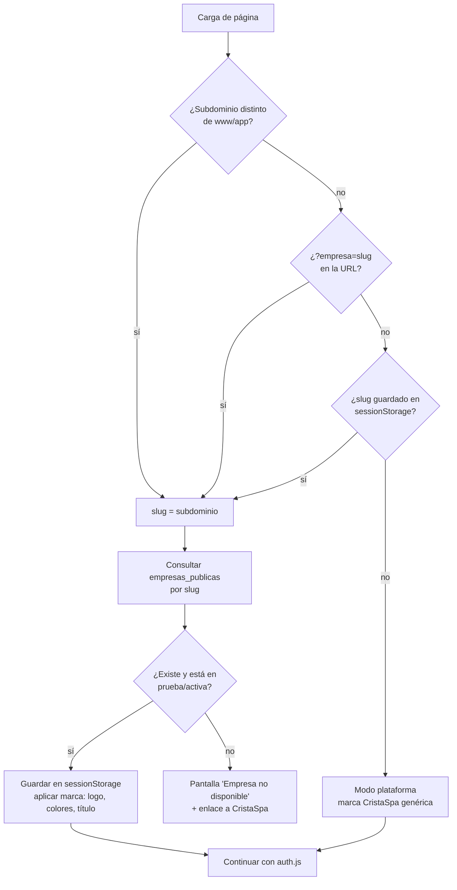
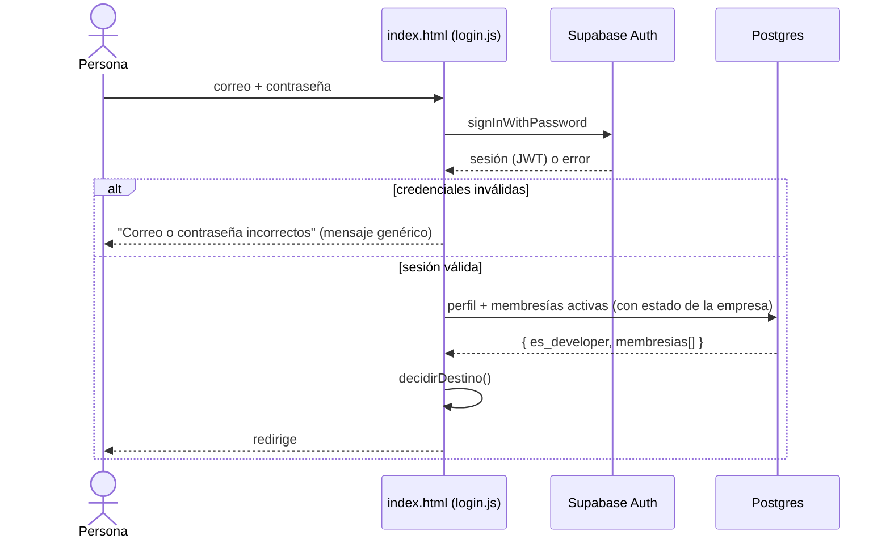
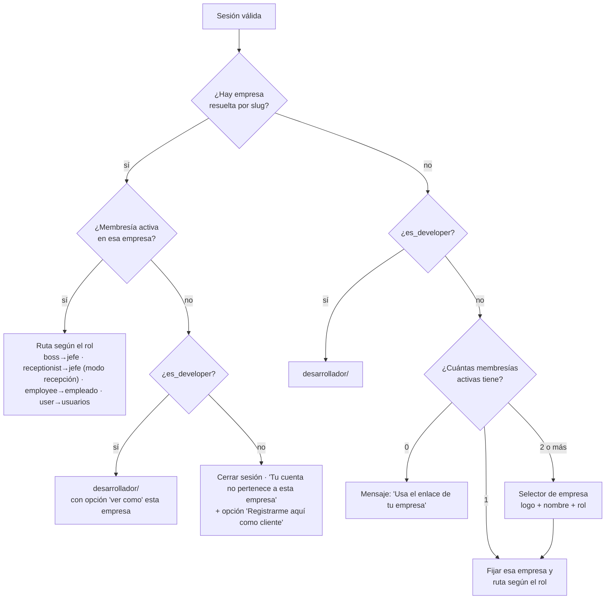
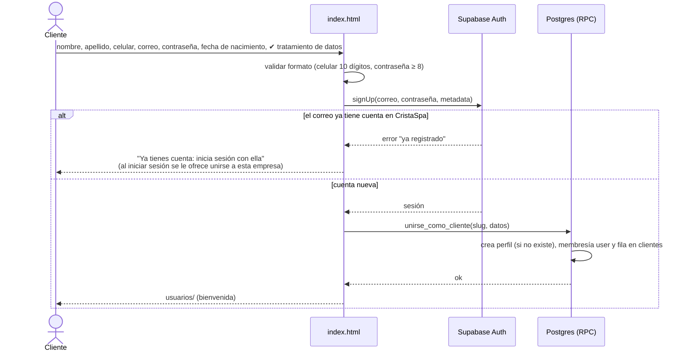
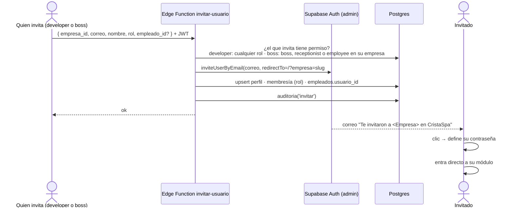

# 06 · Acceso y resolución de empresa

> **Estado:** ✅ Aprobado el 2026-09-25.

## 1. Resolución de empresa (`tenant.js`)

Se ejecuta **en todas las páginas antes que cualquier otra lógica**.

- El slug de la URL **solo decide la marca**. El acceso a los datos lo decide la membresía en la base de datos.
- La marca se guarda en caché durante la sesión para no repetir la consulta en cada página.
- Mientras se resuelve la marca se muestra un esqueleto neutro, para no "flashear" los colores de CristaSpa.

## 2. Inicio de sesión

### `decidirDestino()`

## 3. Registro de cliente (rol `user`)

Solo se permite **con una empresa resuelta**: un cliente siempre se registra en una empresa concreta.

- `unirse_como_cliente` es una RPC: busca la empresa por slug, verifica que esté activa o en prueba y crea la membresía `user`. **El navegador nunca envía `empresa_id` ni `rol`.**
- Si la empresa exige confirmar el correo (configuración de Supabase), se muestra "Revisa tu correo" y la membresía se crea al confirmar y entrar por primera vez.

### Cliente que ya existe en otra empresa

Una persona con cuenta en el spa A entra al enlace del spa B:

1. Inicia sesión con su cuenta de siempre.
2. `decidirDestino` detecta que no tiene membresía en B.
3. Se le ofrece **"Registrarme como cliente de B"**, que llama a `unirse_como_cliente` con un solo clic.

## 4. Invitaciones (jefes y empleados)

## 5. Recuperar contraseña

1. En el login: "¿Olvidaste tu contraseña?" → correo.
2. `resetPasswordForEmail(correo, { redirectTo: '/?empresa=slug#nueva-clave' })`.
3. Siempre se muestra "Si el correo existe, te enviamos un enlace" (no revela qué correos existen).
4. El enlace abre el formulario de nueva contraseña → `updateUser({ password })` → redirección normal.

## 6. Sesión y cierre de sesión

| Tema | Comportamiento |
|---|---|
| Duración | La gestiona Supabase: JWT de 1 h con renovación automática |
| Persistencia | `supabase-js` en `localStorage`. Se eliminan `maisonlash_session` y los usuarios fijos |
| Contexto guardado | `sessionStorage.cristaspa_empresa = { id, slug, nombre, rol }` |
| Guarda de página | `requireRole(['boss'])` valida sesión, membresía y rol **en la base de datos** al cargar la página, no solo en el valor guardado |
| Empresa suspendida con sesión abierta | En la siguiente consulta RLS devuelve vacío o error. La app detecta `empresa.estado` y muestra "Empresa suspendida, contacta a soporte" |
| Membresía desactivada | Igual que el caso anterior: pierde el acceso en la siguiente consulta |
| Cerrar sesión | `signOut()` + limpiar `sessionStorage` → volver a `/?empresa=slug` (se mantiene la marca) |
| Cambiar de empresa | Menú de perfil → "Cambiar empresa" (solo si tiene 2 o más membresías) |

## 7. Pantallas del login

| Estado | Contenido |
|---|---|
| Sin empresa | Logo CristaSpa · "Inicia sesión" · texto "¿Eres cliente? Usa el enlace que te compartió tu spa" · sin opción de registro |
| Con empresa | Logo y colores de la empresa · Iniciar sesión · Crear cuenta · ¿Olvidaste tu contraseña? · pie "Con tecnología de CristaSpa" |
| Empresa no disponible | Mensaje neutro, sin detalles internos |
| Selector de empresa | Tarjetas con logo, nombre y rol |

---

← [05 · Seguridad](05-seguridad.md) · [Índice](README.md) · [07 · Marca dinámica](07-marca-dinamica.md) →
