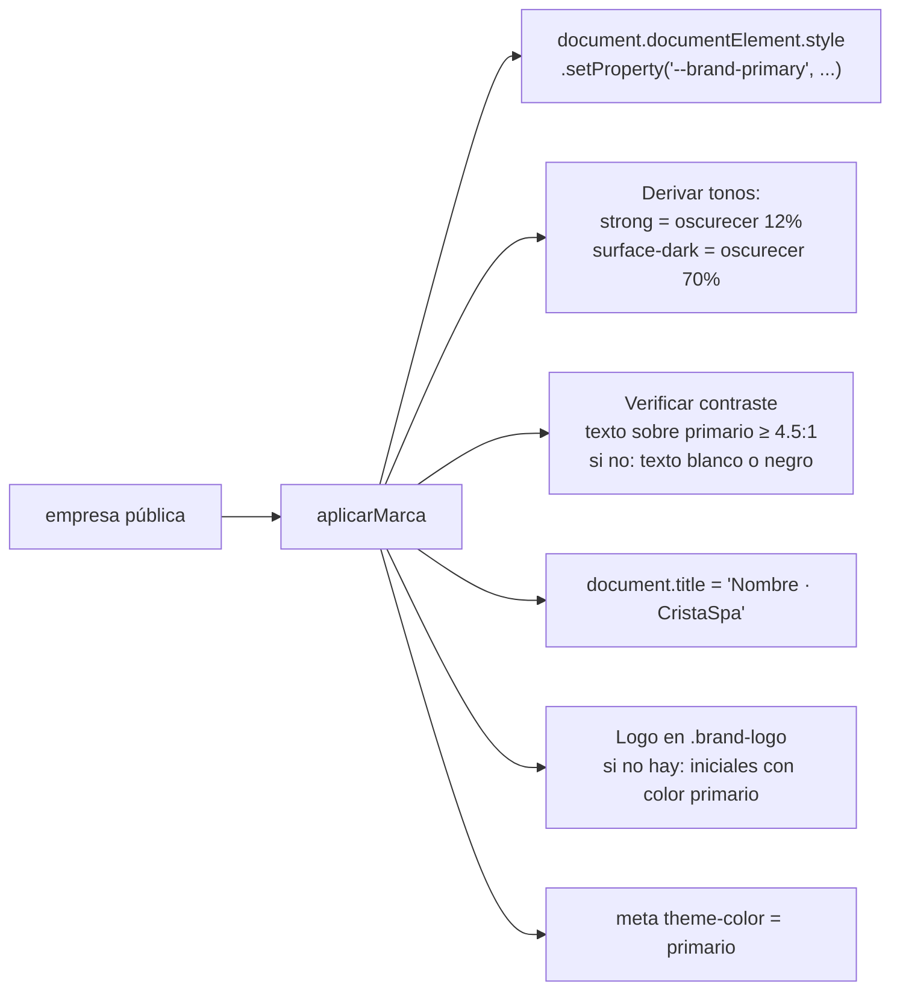

# 07 · Marca dinámica

> **Estado:** ✅ Aprobado el 2026-09-25.

## Capas de marca

| Capa | Dónde se ve | Fuente |
|---|---|---|
| **CristaSpa (plataforma)** | Login sin empresa, módulo desarrollador, correos del sistema, pie "Con tecnología de CristaSpa" | `assets/marca/` + variables por defecto en `base.css` |
| **Empresa** | Login con slug y módulos jefe, empleado y usuario | `empresas_publicas` → variables CSS en tiempo de ejecución |

## Tokens de diseño

Hoy `base.css` ya usa variables (`--teal`, `--gold`, `--bg-deep`…), pero con nombres de color. En v2 se renombran por **función**, para que cualquier empresa pueda cambiarlas:

| v1 | v2 | Origen |
|---|---|---|
| `--teal`, `--teal-2` | `--brand-primary`, `--brand-primary-strong` | `color_primario` (la variante fuerte se calcula) |
| `--gold`, `--gold-2` | `--brand-accent`, `--brand-accent-strong` | `color_acento` |
| `--bg-deep`, `--bg-dark` | `--brand-surface-dark`, `--brand-surface-dark-2` | Se derivan del primario (oscurecido) |
| `--surface*` | `--surface*` | Se mantienen neutros |
| `--rose`, `--coffee` | `--category-*` | Salen de `categorias.color` |
| `--font-brand` | `--font-brand` | Cinzel por defecto. Lista cerrada de 4–5 fuentes elegibles (v2.1) |

## Aplicación en tiempo de ejecución (`tenant.js`)

## Textos que dejan de estar fijos

| Hoy | v2 |
|---|---|
| "MAISON LASH" en los encabezados | `{empresa.nombre}` |
| "Hola Maison Lash, quiero confirmar mi cita." | `empresa_config.mensaje_whatsapp` |
| `maison-lash-clientes.csv` | `{slug}-clientes-{fecha}.csv` |
| "Dueno Maison Lash", "Administrador Maison Lash" | Nombre real del perfil |
| Comentarios `/* Maison Lash - ... */` | `/* CristaSpa - ... */` |
| `wrangler.toml name = "maison-lash-by-cami-portela"` | `name = "cristaspa"` |
| Claves `maisonlash_*` en localStorage | Se eliminan (ver ADR-004) |

## Accesibilidad

- El editor de marca en **Mi empresa** y en el asistente del developer valida el contraste y **no permite guardar** combinaciones ilegibles.
- Los colores de categoría se acompañan siempre de texto (nombre de la categoría); nunca son la única señal.

---

← [06 · Acceso y resolución de empresa](06-flujo-acceso-y-empresa.md) · [Índice](README.md) · [08 · Flujo de citas](08-flujo-citas.md) →
