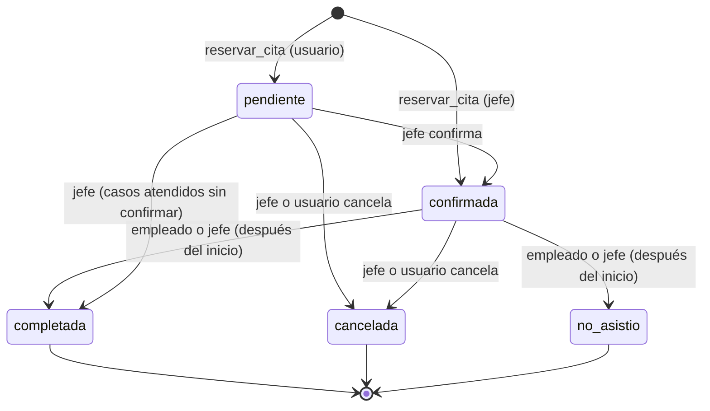
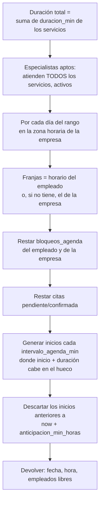
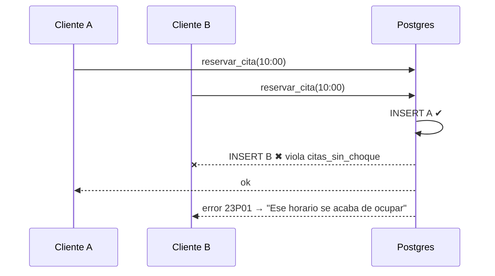

# 08 · Flujo de citas

> **Estado:** ✅ Aprobado el 2026-09-25.

## Máquina de estados

| Transición | boss | employee | user | Condición |
|---|---|---|---|---|
| → `confirmada` | ✅ | ❌ | ❌ | Desde `pendiente` |
| → `cancelada` | ✅ | ❌ | ✅ (las propias) | Usuario: `usuario_puede_cancelar` y antes de `horas_limite_cancelacion` |
| → `completada` | ✅ | ✅ (las suyas) | ❌ | `now() >= inicio` |
| → `no_asistio` | ✅ | ✅ (las suyas) | ❌ | `now() >= inicio` |
| Reabrir un estado final | ❌ | ❌ | ❌ | Solo el developer, corrigiendo con auditoría |

Cada transición guarda quién la hizo y cuándo en `auditoria`.

## Cálculo de disponibilidad

RPC `disponibilidad(p_empresa, p_empleado | null, p_servicios[], p_desde, p_hasta)`:

**Ejemplo:** la empresa abre de 09:00 a 12:00, el intervalo es de 30 min, el servicio dura 90 min y hay una cita de 10:00 a 11:00.
Inicios libres: **09:00** no (se cruzaría con la de las 10:00), ninguno entre 09:30 y 10:30, y el de 11:00 no cabe (termina 12:30). **Resultado: ninguno ese día.** Así se evitan las citas "partidas" que v1 permitía con horarios fijos de 1 hora.

## Reserva segura (concurrencia)

El `EXCLUDE` de [04](04-modelo-de-datos.md#citas) garantiza que **nunca** haya dos citas activas cruzadas para el mismo especialista, aunque lleguen al mismo tiempo. El frontend solo traduce el error a un mensaje.

## Tiempo real

| Evento | Quién se entera | Cómo |
|---|---|---|
| Cita nueva o cambiada | Jefe (toda la empresa), empleado asignado, cliente dueño | Canal `citas:empresa_id=eq.X`, filtrado además por RLS |
| Servicio o precio cambiado | Vistas de catálogo abiertas | Canal `servicios:empresa_id=eq.X` |
| Empresa suspendida | Todos los miembros conectados | Canal `empresas:id=eq.X` → pantalla de suspendida |

## Notificaciones (v2)

- Enlace `wa.me` con la plantilla, al reservar (cliente → negocio), como en v1.
- Botón de WhatsApp del jefe hacia el cliente para confirmar o recordar.
- Archivo `.ics` para agregar la cita al calendario del cliente.
- *Fuera de alcance:* recordatorios automáticos por la API de WhatsApp o por correo ([01](01-vision-y-alcance.md#fuera-de-alcance-v2)).

---

← [07 · Marca dinámica](07-marca-dinamica.md) · [Índice](README.md) · [09 · Módulo jefe](09-modulo-jefe.md) →
