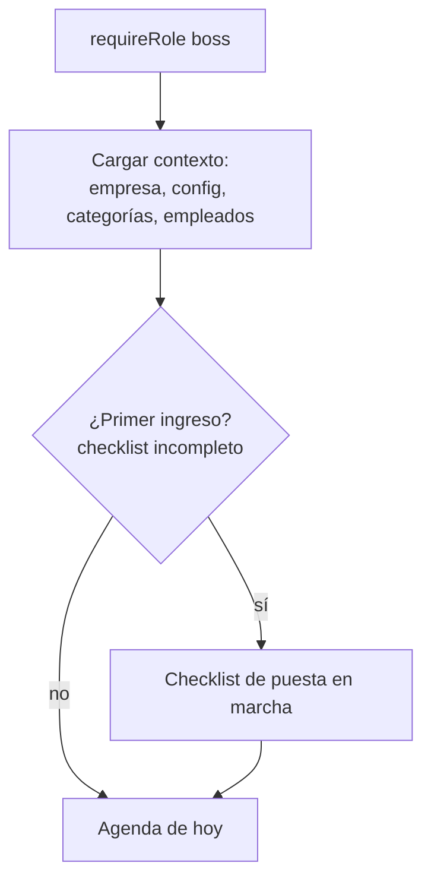
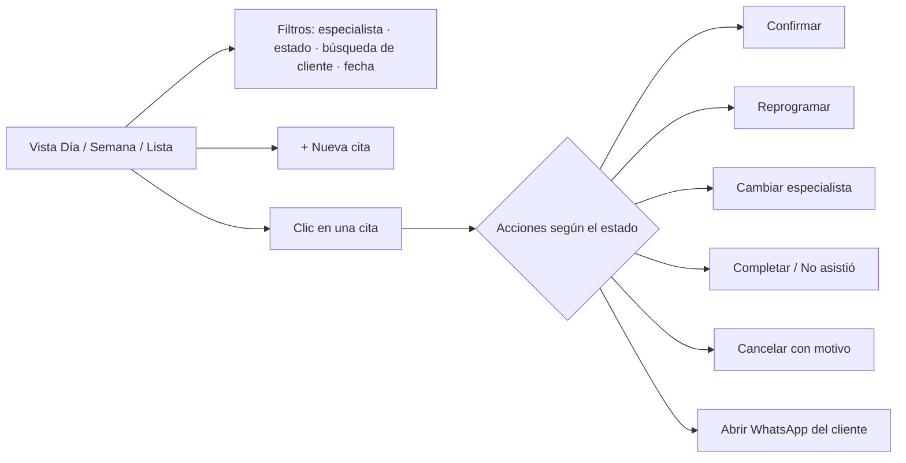
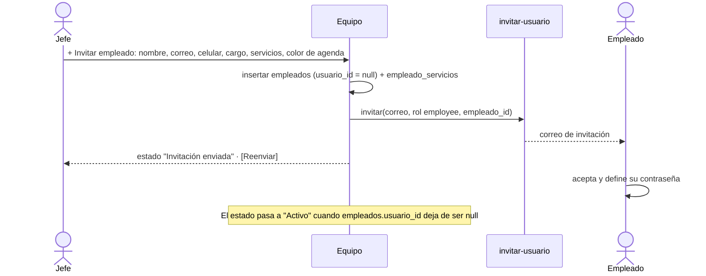

# 09 · Módulo jefe

> **Estado:** ✅ Aprobado el 2026-09-25.

> **Quién lo ve:** miembros con rol `boss` en la empresa activa (y developers en "ver como"). El rol `receptionist` usa este mismo módulo en **modo recepción**: solo las pestañas Agenda y Clientes, sin exportar datos ni acceder a Catálogo, Equipo, Mi empresa o Reportes.
> **Ruta:** `/jefe/html/index.html`.
> **Cambio principal respecto a v1:** todo queda limitado a su `empresa_id`, las categorías y horarios son configurables, y los empleados se **invitan** en lugar de crearles usuario y contraseña.

## Navegación

| v1 | v2 | Cambio |
|---|---|---|
| Servicios | **Catálogo** → Servicios · Productos · Categorías | Categorías propias, precio numérico, duración |
| Productos | (dentro de Catálogo) | |
| Empleados | **Equipo** | Invitación por correo, horario propio, servicios que atiende |
| Calendario | **Agenda** | Vista día/semana por especialista, reservas con disponibilidad real |
| — | **Clientes** | Nuevo: lista, ficha, historial de citas |
| Config | **Mi empresa** | Marca, WhatsApp, redes, horarios, reglas de agenda |
| Archivos | **Reportes** | CSV + indicadores básicos |

## Flujo general

### Checklist de puesta en marcha

Se muestra hasta que todo esté completo:

1. ☐ Subir logo y elegir colores
2. ☐ Revisar categorías y servicios (vienen de la plantilla)
3. ☐ Definir horarios de atención
4. ☐ Invitar al menos un empleado y asignarle servicios
5. ☐ Configurar el WhatsApp de confirmación
6. ☐ Copiar el enlace de la empresa para compartirlo con los clientes

## 1. Agenda

### Nueva cita (jefe)

1. **Cliente:** buscar uno existente por nombre, correo o celular, o crear uno rápido (nombre + celular; el correo es opcional).
2. **Servicios:** uno o varios. Se muestran la duración y el precio totales.
3. **Especialista:** solo los que atienden **todos** los servicios elegidos, o "Cualquiera disponible".
4. **Fecha y hora:** cuadrícula de `disponibilidad()`. Las horas ocupadas o fuera de horario no se pueden elegir.
5. **Estado inicial:** `confirmada` por defecto (la crea el negocio). Notas opcionales.
6. Guardar → `reservar_cita` → toast. Si la base rechaza por choque de horario: "Ese horario acaba de ocuparse" y se refresca la cuadrícula.

## 2. Catálogo

| Sub-vista | Campos | Reglas |
|---|---|---|
| **Categorías** | nombre, color, orden, activo | No se puede desactivar una categoría con servicios activos sin moverlos antes |
| **Servicios** | categoría, nombre, descripción, precio (numérico, con formato de moneda), duración (min), imagen, activo, orden | Desactivar en lugar de borrar. Validar `limites.max_servicios` |
| **Productos** | categoría, nombre, descripción, precio (opcional), imagen, activo | Solo vitrina, no hay venta en línea |

Imagen: se elige → se recorta y comprime en el navegador → se sube a `empresas/<empresa_id>/servicios/<id>.webp`.

## 3. Equipo

- **Horario propio** por empleado (si no tiene, usa el de la empresa).
- **Ausencias:** vacaciones o citas médicas, que se guardan en `bloqueos_agenda`.
- **Desactivar empleado:** pide qué hacer con sus citas futuras:
  - reasignarlas a otro especialista, o
  - dejarlas "sin asignar" y avisar.

  Después se desactiva la membresía.
- También puede invitar a **otro jefe** (socio o administrador) para su empresa.

## 4. Clientes

- Lista con búsqueda, número de citas, última visita y cumpleaños del mes.
- Ficha: datos, `notas_internas`, historial de citas y botón "Nueva cita".
- Crear o editar un cliente sin cuenta (clientes que reservan por teléfono).
- **Exportar CSV.**

## 5. Mi empresa

| Sección | Contenido |
|---|---|
| Marca | Logo, colores con vista previa en vivo ([07](07-marca-dinamica.md)) |
| Contacto | WhatsApp, Instagram, Facebook, TikTok (+ activos) |
| Horarios | Franjas por día de la semana, festivos y cierres |
| Reglas de agenda | Intervalo, anticipación mínima, días máximos, cancelación por el usuario y límite de horas |
| Mensaje de WhatsApp | Plantilla con variables y vista previa |
| Enlace de la empresa | `https://cristaspa.app/?empresa=slug` + **código QR** descargable |

## 6. Reportes

| Reporte | Formato |
|---|---|
| Clientes | CSV (como en v1) |
| Citas atendidas por rango de fechas | CSV (antes solo "atendidos", sin rango) |
| Indicadores del mes | Citas por estado, ingresos estimados (suma de `total` de las completadas), servicios más pedidos, ocupación por especialista, tasa de inasistencia |

## Estados vacíos y errores

| Situación | Mensaje |
|---|---|
| Sin conexión | Banda "Sin conexión, los cambios no se guardarán". Los botones de guardar se deshabilitan |
| Error de permisos (RLS) | "No tienes permiso para esta acción" + se registra en consola |
| Límite del plan | "Tu plan permite N empleados. Contacta a CristaSpa para ampliarlo" |
| Empresa suspendida | Pantalla completa "Tu empresa está suspendida. Contacta a soporte" |

---

← [08 · Flujo de citas](08-flujo-citas.md) · [Índice](README.md) · [10 · Módulo empleado](10-modulo-empleado.md) →
