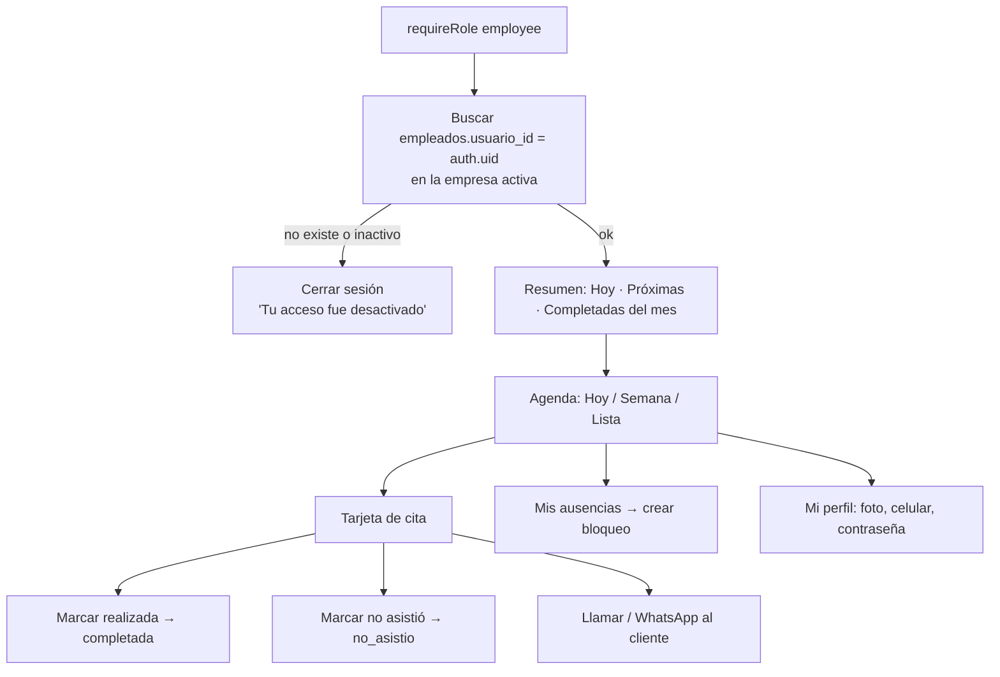

# 10 · Módulo empleado

> **Estado:** ✅ Aprobado el 2026-09-25.

> **Quién lo ve:** miembros con rol `employee` en la empresa activa.
> **Ruta:** `/empleado/html/index.html`.
> **Cambio principal respecto a v1:** login con cuenta real (invitación), agenda en la zona horaria de la empresa, estado "no asistió" y ausencias propias.

## Flujo

## Tarjeta de cita

| Dato | Visible |
|---|---|
| Hora de inicio y fin | ✅ |
| Cliente (nombre y celular) | ✅ |
| Servicios y duración | ✅ |
| Estado | ✅ |
| Notas de la cita | ✅ |
| Notas internas del cliente | ❌ (solo el jefe) |
| Precio / total | Configurable (por defecto oculto) |

## Reglas

- Solo ve las citas con `empleado_id` propio (RLS).
- Solo puede pasar sus citas a `completada` o `no_asistio`, y **no antes de la hora de inicio** (RPC `cambiar_estado_cita`).
- Puede crear **bloqueos** en su agenda (ausencias). No puede borrar ni mover citas.
- **Tiempo real:** si el jefe o un cliente crea, mueve o cancela una de sus citas, la agenda se actualiza sola y muestra un toast "Nueva cita 3:00 p. m.".
- "Hoy" se calcula en la `zona_horaria` de la empresa, lo que corrige el error de UTC de v1.

---

← [09 · Módulo jefe](09-modulo-jefe.md) · [Índice](README.md) · [11 · Módulo usuario (cliente final)](11-modulo-usuario.md) →
