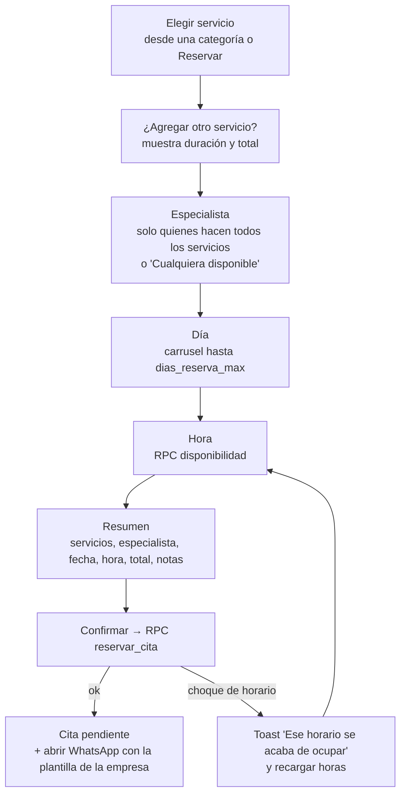

# 11 · Módulo usuario (cliente final)

> **Estado:** ✅ Aprobado el 2026-09-25.

> **Quién lo ve:** miembros con rol `user` en la empresa activa.
> **Ruta:** `/usuarios/html/index.html`.
> **Cambio principal respecto a v1:** marca de la empresa, categorías dinámicas, disponibilidad real según la duración, reservar varios servicios, cancelar o reprogramar y ver las redes sociales.

## Navegación

| v1 | v2 |
|---|---|
| Mis citas · Productos · Servicios · Cejas · Labios · Pestañas (fijas) | **Inicio** · **Reservar** · **Mis citas** · **Productos** · **Perfil** |
| | Las pestañas de categoría se generan desde `categorias` de la empresa |

## Inicio

- Saludo + **próxima cita** con cuenta regresiva (como en v1).
- Categorías de la empresa como accesos rápidos.
- Redes sociales activas y botón de WhatsApp de la empresa.

## Flujo de reserva

- Con "Cualquiera disponible", `disponibilidad` une los horarios de todos los especialistas aptos y `reservar_cita` asigna al primero libre, repartiendo la carga.
- Los días sin ninguna hora libre se muestran deshabilitados.
- El WhatsApp usa `empresa_config.whatsapp` y `mensaje_whatsapp`. Si no hay número configurado, no se abre y el toast dice "Tu cita quedó registrada".

## Mis citas

| Pestaña | Contenido | Acciones |
|---|---|---|
| Próximas | `pendiente` / `confirmada`, en orden | **Cancelar** (si `usuario_puede_cancelar` y faltan más de `horas_limite_cancelacion` horas) · **Reprogramar** (mismas reglas) · Agregar al calendario (.ics) |
| Historial | `completada` / `cancelada` / `no_asistio` | **Volver a reservar** (precarga los mismos servicios) |

Cancelar pide un motivo opcional y llama a `cambiar_estado_cita(..., 'cancelada')`. El horario se libera al instante para los demás.

## Productos

Vitrina de solo lectura, filtrable por categoría (igual que v1).

## Perfil

Editar nombre, celular y fecha de nacimiento · cambiar contraseña · cerrar sesión · **eliminar mi cuenta en esta empresa** (derecho de supresión de la Ley 1581: desactiva la membresía y anonimiza sus datos de cliente, conservando las citas históricas sin datos personales).

---

← [10 · Módulo empleado](10-modulo-empleado.md) · [Índice](README.md) · [12 · Módulo desarrollador](12-modulo-desarrollador.md) →
