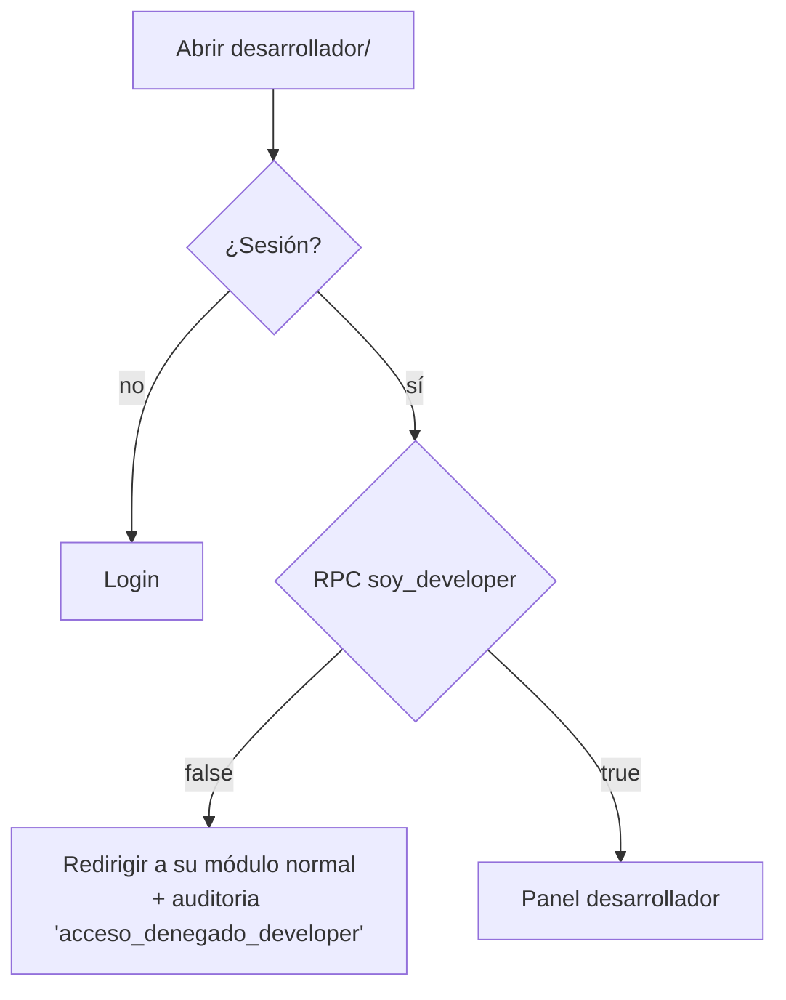
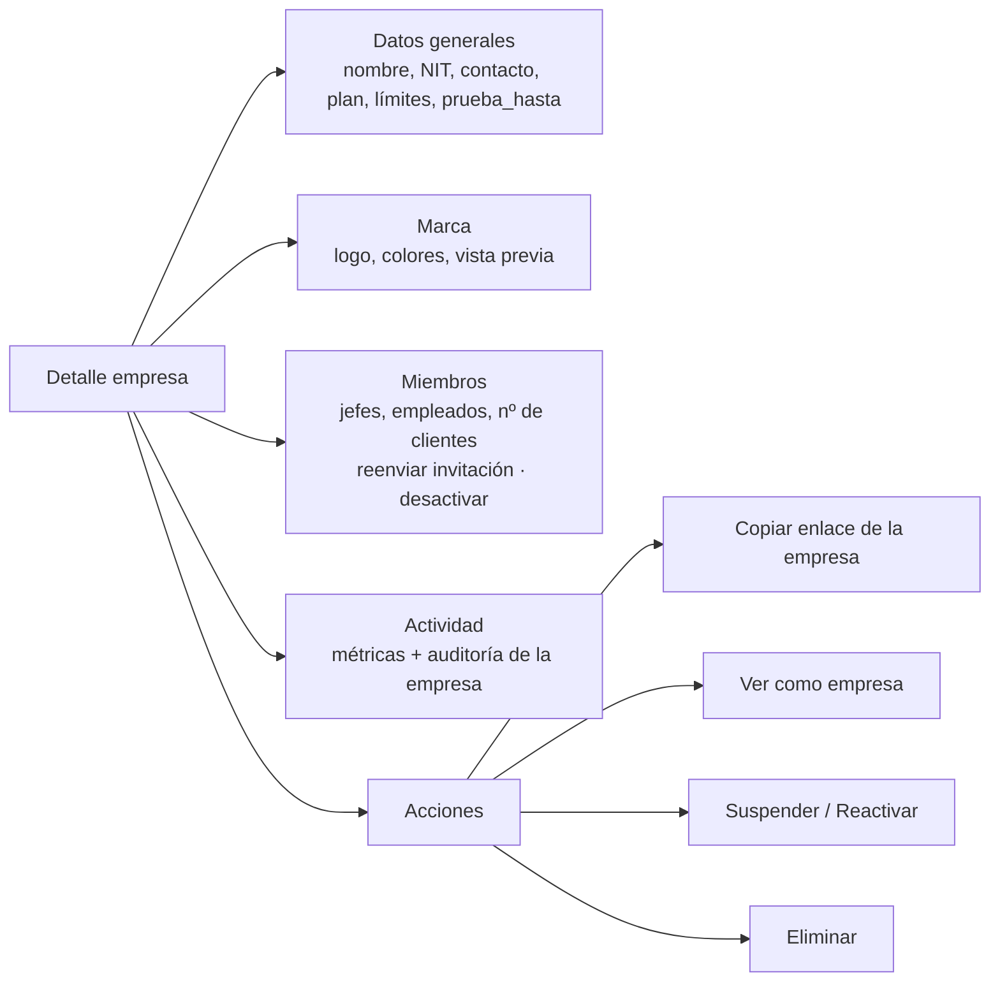
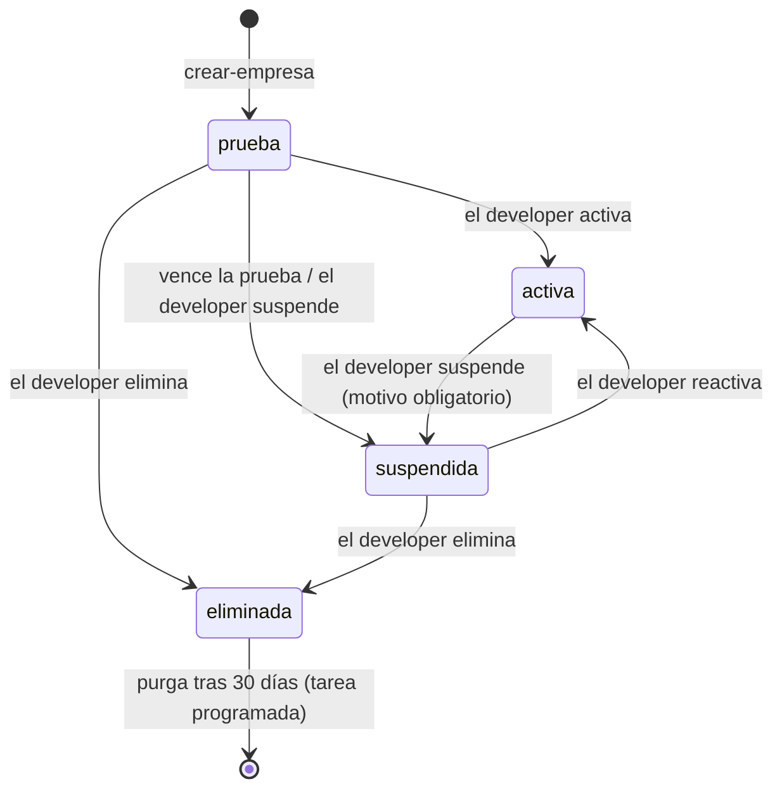
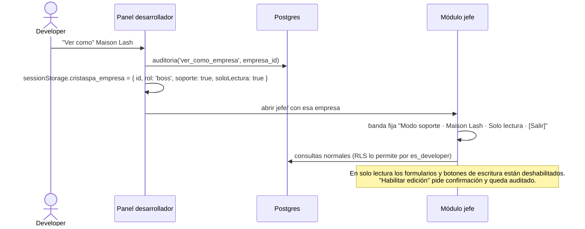

# 12 · Módulo desarrollador

> **Estado:** ✅ Aprobado el 2026-09-25.

> **Quién lo ve:** solo las personas con `perfiles.es_developer = true`.
> **Ruta:** `/desarrollador/html/index.html`.
> **Propósito:** administrar la plataforma CristaSpa y todas sus empresas.

## Acceso



- El enlace al módulo **no aparece en ninguna pantalla** de los demás roles.
- Aunque alguien descargue el HTML, no ve datos: todas las consultas pasan por RLS con `es_developer()`.
- **Recomendado (fase de endurecimiento):** exigir segundo factor (TOTP de Supabase Auth MFA) a los developers.

## Navegación

```text
┌─────────────────────────────────────────────────────────┐
│ CristaSpa · Desarrollador                 [perfil ▾]    │
├─────────────────────────────────────────────────────────┤
│ Resumen │ Empresas │ Nueva empresa │ Usuarios │         │
│ Plantillas │ Auditoría │ Sistema                        │
└─────────────────────────────────────────────────────────┘
```

## 1. Resumen (dashboard)

| Indicador | Fuente |
|---|---|
| Empresas por estado (prueba / activa / suspendida) | `empresas` |
| Empresas nuevas en los últimos 30 días | `empresas.created_at` |
| Pruebas que vencen en los próximos 7 días | `empresas.prueba_hasta` |
| Citas del mes, total y por empresa (top 10) | `citas` |
| Usuarios activos por rol | `membresias` |
| Empresas sin actividad en 14 días (riesgo de abandono) | última `citas.created_at` por empresa |

Se calcula con una RPC `metricas_plataforma()` que solo acepta developers, para no traer todas las filas al navegador.

## 2. Empresas

### Lista

Columnas: logo · nombre · slug · estado · plan · nº de empleados · citas del mes · creada · acciones.

Filtros: texto (nombre/slug/NIT), estado, plan. Orden por fecha o por actividad.

### Detalle de empresa



### Cambios de estado de una empresa



| Acción | Confirmación | Efecto |
|---|---|---|
| Suspender | Escribir el slug + motivo | Los miembros pierden el acceso de inmediato (RLS). Los datos se conservan |
| Reactivar | Clic | Se restablece el acceso |
| Eliminar | Escribir el slug + "ELIMINAR" | `estado = eliminada`, `eliminado_at = now()`. Se ofrece antes descargar un respaldo (JSON/CSV) |
| Purga | Automática a los 30 días | Borra las filas y los archivos de Storage de la empresa. Queda registrado en `auditoria` |

Todas pasan por la RPC `cambiar_estado_empresa` (función de Postgres que valida `es_developer()`; no necesita Edge Function porque no usa la `service_role`).

### Ver como empresa (soporte)



## 3. Nueva empresa

Asistente de onboarding. Flujo completo en [11 · Onboarding de empresas](13-onboarding-empresas.md).

## 4. Usuarios (búsqueda global)

- Buscar por correo o nombre en toda la plataforma.
- Ver sus membresías: empresa · rol · estado.
- Acciones: reenviar invitación, enviar enlace para restablecer contraseña, desactivar una membresía, cerrar todas sus sesiones.
- **Gestionar desarrolladores:** otorgar o quitar `es_developer`. Requiere confirmar escribiendo el correo y queda auditado. No se puede quitar el rol al último developer.

## 5. Plantillas

Catálogos base que se copian al crear una empresa:

| Plantilla | Contenido |
|---|---|
| `pestanas-y-cejas` | Categorías Pestañas, Cejas y Labios + los 10 servicios actuales de Maison Lash |
| `spa-bienestar` | Masajes, Faciales, Corporales + servicios tipo |
| `unas` | Manos, Pies, Acrílicas + servicios tipo |
| `barberia` | Corte, Barba, Combos + servicios tipo |
| `vacia` | Solo una categoría "General" |

Se guardan en `plantillas (id, nombre, contenido jsonb)`, una tabla de plataforma que solo leen y editan developers.

## 6. Auditoría

- Tabla filtrable: fecha · empresa · actor · acción · entidad.
- Detalle con el antes y el después (diff de JSON).
- Exportar a CSV.

## 7. Sistema

- Versión desplegada (commit y fecha) y entorno (dev/prod).
- Estado de las Edge Functions (última ejecución y errores).
- Enlaces al panel de Supabase y a Cloudflare.

## Componentes técnicos del módulo

| Pieza | Descripción |
|---|---|
| `desarrollador/js/desarrollador.js` | Controlador de las vistas |
| `repos/empresas.js` | Listar, detalle y métricas |
| RPC `metricas_plataforma()`, `metricas_empresa(id)` | Agregados en el servidor |
| RPC `crear_empresa`, `cambiar_estado_empresa`, `asignar_developer` · Edge `crear-empresa` (llama a la RPC e invita al jefe), `invitar-usuario` | Operaciones privilegiadas |
| Tarea programada `purgar-empresas` (pg_cron) | Purga a los 30 días y vence pruebas |

---

← [11 · Módulo usuario (cliente final)](11-modulo-usuario.md) · [Índice](README.md) · [13 · Onboarding de empresas](13-onboarding-empresas.md) →
