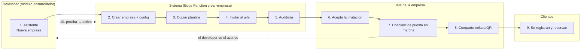
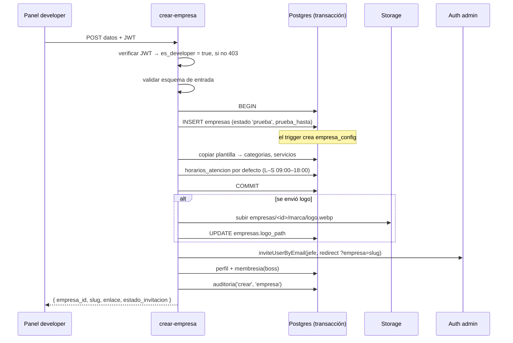

# 13 · Onboarding de empresas

> **Estado:** ✅ Aprobado el 2026-09-25.

> Objetivo: que una empresa nueva pase de "no existe" a "recibiendo reservas" en **menos de 5 minutos** de trabajo del developer y un día de configuración del jefe.

## Vista de punta a punta

## 1. Asistente "Nueva empresa" (4 pasos)

| Paso | Campos | Validaciones |
|---|---|---|
| **1. Datos** | Nombre comercial*, slug* (se sugiere desde el nombre), razón social, NIT, correo y teléfono de contacto | Slug con formato válido, **disponible** (se verifica en vivo) y no reservado |
| **2. Marca** | Logo (opcional), color primario, secundario y de acento | Contraste suficiente entre texto y fondo (WCAG AA). Vista previa del login y de una tarjeta |
| **3. Configuración** | Plantilla de catálogo*, zona horaria (por defecto Bogotá), moneda (COP), plan, límites, días de prueba (por defecto 14) | |
| **4. Jefe** | Nombre* y correo* del jefe · ¿enviar la invitación ya? (sí por defecto) | Formato de correo. Si el correo ya tiene cuenta se avisa: "Se le agregará como jefe" |

Pantalla final: **resumen → "Crear empresa"**.

## 2. Edge Function `crear-empresa`

**Si algo falla:**

| Punto de falla | Resultado |
|---|---|
| Antes del COMMIT | Se revierte todo y no queda nada creado |
| Falla la subida del logo | La empresa queda creada sin logo, con aviso "Sube el logo desde Marca" |
| Falla la invitación | La empresa queda creada, con aviso y botón "Reintentar invitación" |

La función es **idempotente por slug**: reintentar no duplica la empresa.

## 3. Primer ingreso del jefe

1. Abre el correo → define su contraseña → llega a `jefe/` con la marca de su empresa.
2. Ve el **checklist de puesta en marcha** ([09](09-modulo-jefe.md#checklist-de-puesta-en-marcha)).
3. Al terminarlo se muestra el enlace y el **QR** para compartir.

## 4. Seguimiento del developer

En **Empresas → detalle**:
- Avance del checklist (logo, servicios, horarios, empleados, WhatsApp).
- Primera cita recibida (sí/no).
- Botón **Activar** (prueba → activa). La tarea diaria avisa de las pruebas que vencen en 3 días.

## 5. Criterios de "empresa lista"

- [ ] Invitación del jefe aceptada
- [ ] Al menos 1 servicio activo
- [ ] Horario de atención definido
- [ ] Al menos 1 empleado activo con servicios asignados
- [ ] WhatsApp configurado
- [ ] Primera reserva de prueba realizada y cancelada correctamente

---

← [12 · Módulo desarrollador](12-modulo-desarrollador.md) · [Índice](README.md) · [14 · Migración de Maison Lash (v1 → v2)](14-migracion-maison-lash.md) →
