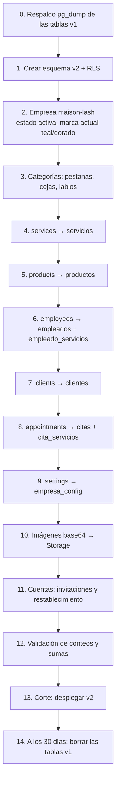

# 14 · Migración de Maison Lash (v1 → v2)

> **Estado:** ✅ Aprobado el 2026-09-25.

> Maison Lash se convierte en la **primera empresa** de CristaSpa (`slug = maison-lash`) sin perder servicios, productos, clientes, empleados ni citas.

## Estrategia

- **Esquema v2 en paralelo:** las tablas v1 (`services`, `products`, `clients`, `employees`, `appointments`, `settings`) **no se modifican** durante la migración y sirven de respaldo y de vía de regreso.
- **Script idempotente** (`supabase/migrations/…_migrar_v1.sql` + script Deno para imágenes y cuentas), que se ensaya primero en dev con una copia de los datos reales.
- **Tabla temporal `mapa_ids(tipo, id_v1, id_v2)`** para traducir los ids de texto (`svc-1`, `emp-demo`…) a UUID.

## Pasos



## Reglas de transformación

| Origen v1 | Destino v2 | Transformación |
|---|---|---|
| `services.price` `"$80.000"` | `servicios.precio` `80000.00` | Quitar `$`, `.` y espacios → numeric. Si no se puede leer → null + reporte |
| (no existe) | `servicios.duracion_min` | `60` (igual que v1). El jefe lo ajusta después |
| `services.category` | `servicios.categoria_id` | Buscar en las categorías creadas en el paso 3 |
| `services.image` (base64) | `servicios.imagen_path` | Decodificar → WebP → Storage |
| `products.price` `"Precio por confirmar"` | `productos.precio` | `null` |
| `employees.serviceIds[]` | `empleado_servicios` | Una fila por servicio (traducido por `mapa_ids`) |
| `employees.usuario` / `password` | — | **Se descartan.** El empleado recibe una invitación a su correo |
| `clients.password` | — | **Se descarta.** Se crea la cuenta y se envía un correo para definir contraseña |
| `clients.birthday` | `clientes.fecha_nacimiento` | Directo |
| `appointments.date` + `time` | `citas.inicio` | `(date + time) at time zone 'America/Bogota'` |
| (no existe) | `citas.fin` | `inicio + suma de las duraciones` (60 min por servicio) |
| `appointments.clientEmail` / `clientPhone` | `citas.cliente_id` | Buscar el cliente por correo, luego por celular. Si no existe, se crea "sin cuenta" |
| `appointments.employeeId` `''` | `citas.empleado_id` | `null` |
| `appointments.status` | `citas.estado` | Igual (pendiente/confirmada/completada/cancelada) |
| `appointments.source` | `citas.origen` | `usuario` / `jefe` |
| `appointments.serviceIds` | `cita_servicios` | Con nombre y precio **congelados** del servicio en ese momento |
| `settings (key, value)` | `empresa_config` | Una columna por clave |

## Casos especiales

| Caso | Tratamiento |
|---|---|
| Datos demo (`client-demo`, `emp-demo`, "Cita de ejemplo") | **No se migran a producción.** Van a `seed.sql` de dev |
| Usuarios fijos (`usuario`, `jefe`, `admin`) | Se eliminan. La dueña de Maison Lash recibe una invitación `boss` con su correo real |
| Citas v1 que se cruzan (v1 no validaba duración) | Se migran; las que violen la restricción `EXCLUDE` pasan a `cancelada` con la nota "Conflicto de migración" y se listan en el reporte para revisión manual |
| Correos repetidos entre clientes | Se unifican en un solo cliente y sus citas se reasignan |
| Cliente sin correo | Se crea como cliente sin cuenta. Puede registrarse después con el mismo celular y el sistema lo vincula |

## Validación (paso 12)

```sql
-- Debe coincidir 1:1 (restando las filas demo excluidas, que el script cuenta aparte)
select 'servicios', (select count(*) from services),     (select count(*) from servicios where empresa_id = :ml);
select 'citas',     (select count(*) from appointments), (select count(*) from citas     where empresa_id = :ml);
-- Suma de precios de las citas completadas: v1 vs v2
```

Resultado esperado: **reporte de migración** (`docs/migracion-reporte.md`) con conteos por tabla, filas con problemas y acciones tomadas.

## Corte y vuelta atrás

| Momento | Acción |
|---|---|
| T-2 días | Avisar a Maison Lash de una ventana de 1 hora sin reservas |
| T0 | Poner v1 en modo lectura (aviso en el login) → ejecutar la migración → validar → desplegar v2 |
| T0 + 1 h | Prueba rápida: login jefe, crear cita, verla como empleado, reservar como cliente |
| **Vuelta atrás** | Si falla algo crítico: volver a desplegar el commit v1 (las tablas v1 siguen intactas) y volver a intentar |
| T + 30 días | Borrar las tablas v1 (con respaldo previo guardado fuera de Supabase) |

---

← [13 · Onboarding de empresas](13-onboarding-empresas.md) · [Índice](README.md) · [15 · Plan de implementación](15-plan-de-implementacion.md) →
