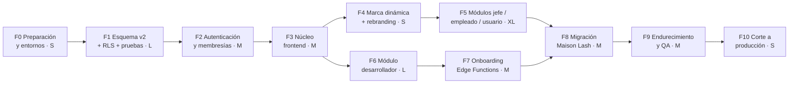

# 15 · Plan de implementación

> **Estado:** ✅ Aprobado el 2026-09-25.

## Forma de trabajo

- **Rama principal del proyecto:** `feature/cristaspa-v2`, con **una rama y un PR por fase** que se fusionan en ella. `main` sigue sirviendo la v1 hasta el corte.
- **Commits convencionales** (`feat:`, `fix:`, `db:`, `docs:`, `test:`).
- **Cada fase termina con demo + visto bueno** antes de empezar la siguiente.
- **CI (GitHub Actions)** en cada PR:
  1. `supabase db lint` + aplicar migraciones en un Supabase local
  2. Pruebas de RLS, aislamiento y reglas de negocio (`npm test`: PGlite + `node --test`, sin Docker)
  3. Revisión de que `service_role` no aparezca fuera de `supabase/functions`
  4. Pruebas E2E (Playwright, viewport móvil) contra el preview de Cloudflare

## Avance

| Fase | Estado | Detalle |
|---|---|---|
| F0 · Preparación | ✅ Lista | Rama `feature/cristaspa-v2`, `package.json`, `supabase/config.toml`, `compartido/js/config.js` (proyecto dev `sgtrclofajcbnswvtdip` + clave pública), `_headers`, `.assetsignore`, `.gitignore`, `scripts/check-secrets.mjs`, CI. **Pendiente:** primera ejecución del CI en GitHub |
| F1 · Esquema + RLS + pruebas | ✅ Aplicada en dev | 8 migraciones aplicadas en `cristaspa-dev` (16 tablas, 0 sin RLS, 5 plantillas, bucket `empresas`, `db lint` sin avisos) y 50 pruebas en verde. Verificado con la clave pública: sin sesión solo se lee `empresas_publicas`. **Pendiente:** usuarios demo (van con F2) |
| F2–F10 | ⬜ | — |

## Fases

Tamaño relativo del esfuerzo: S (pequeño), M, L, XL. F6 y F7 pueden avanzar en paralelo con F4 y F5.

### F0 · Preparación y entornos

- Crear el proyecto Supabase **dev** (o usar Supabase local con la CLI) y dejar el actual como origen de la migración.
- `supabase init`, carpeta `supabase/`, `config.js` por entorno, `_headers`, ajustes de `.assetsignore`.
- Configurar CI y la rama `feature/cristaspa-v2`.
- **Hallazgo urgente de seguridad v1** ([05](05-seguridad.md)): revisarlo y mitigarlo.
- ✅ **Criterio de aceptación:** un PR vacío pasa el CI y el preview de Cloudflare responde.

### F1 · Esquema v2 + RLS + pruebas

- Migraciones: tablas de [04](04-modelo-de-datos.md), FK compuestas, `EXCLUDE`, índices, triggers, `empresas_publicas`, bucket y políticas de Storage.
- Funciones `es_developer`, `tiene_rol` y las RPC `disponibilidad`, `reservar_cita`, `cambiar_estado_cita`, `reprogramar_cita`, `unirse_como_cliente`.
- `seed.sql`: 2 empresas demo (`demo-lash`, `demo-spa`) con un usuario por rol cada una + 1 developer.
- **Pruebas del esquema** con PGlite + `node --test` (ver abajo).
- ✅ **Criterio de aceptación:** matriz de aislamiento 100 % en verde y la prueba de doble reserva concurrente rechazada.

### F2 · Autenticación y membresías

- `auth.js` nuevo: login, registro (`unirse_como_cliente`), recuperación, `decidirDestino`, selector de empresa, `requireRole` contra la base.
- Plantillas de correo de Supabase Auth en español con marca CristaSpa.
- Turnstile en login y registro.
- ✅ **Criterio de aceptación:** los 4 roles de las 2 empresas demo entran a su módulo, y un usuario de `demo-lash` en el enlace de `demo-spa` ve "no perteneces".

### F3 · Núcleo frontend

- Pasar a módulos ES: `supabase.js`, `tenant.js`, `fechas.js`, `repos/*`.
- Retirar `data-store.js` v1 y las claves `maisonlash_*`.
- Manejo uniforme de errores (RLS, red, choque de horario) → toasts.
- ✅ **Criterio de aceptación:** ninguna página llama a `supabase.from` fuera de `repos/`.

### F4 · Marca dinámica y rebranding

- Tokens `--brand-*` en `base.css` y `aplicarMarca()`.
- Eliminar todas las referencias fijas a Maison Lash, logo CristaSpa por defecto y `wrangler.toml` → `cristaspa`.
- ✅ **Criterio de aceptación:** `grep -ri "maison" --include=*.{html,js,css,toml}` → 0 resultados. Las 2 empresas demo se ven con sus colores.

### F5 · Módulos jefe, empleado y usuario

- Jefe: Agenda, Catálogo (con categorías), Equipo (invitaciones), Clientes, Mi empresa, Reportes y checklist ([09](09-modulo-jefe.md)).
- Empleado: agenda, estados, ausencias ([10](10-modulo-empleado.md)).
- Usuario: reserva con disponibilidad real, varios servicios, cancelar, reprogramar, .ics ([11](11-modulo-usuario.md)).
- Realtime filtrado por empresa.
- ✅ **Criterio de aceptación:** los escenarios E2E 1–8 en verde.

### F6 · Módulo desarrollador

- Resumen, Empresas (lista y detalle), Usuarios, Plantillas, Auditoría, Sistema, "Ver como" en solo lectura ([12](12-modulo-desarrollador.md)).
- RPC `cambiar_estado_empresa` (ya implementada en F1) y tarea `purgar-empresas`.
- ✅ **Criterio de aceptación:** suspender `demo-spa` corta el acceso de sus usuarios en la siguiente acción, y reactivarla lo devuelve.

### F7 · Onboarding

- Asistente de 4 pasos + Edge Functions `crear-empresa` e `invitar-usuario` ([13](13-onboarding-empresas.md)).
- ✅ **Criterio de aceptación:** crear una empresa nueva, recibir el correo, entrar como jefe, completar el checklist y hacer una reserva de cliente, todo en menos de 5 minutos de trabajo del developer.

### F8 · Migración de Maison Lash

- Script y ensayo en dev con una copia de los datos reales, más el reporte de migración ([14](14-migracion-maison-lash.md)).
- ✅ **Criterio de aceptación:** conteos 1:1, 0 contraseñas migradas, conflictos documentados.

### F9 · Endurecimiento y QA

- MFA para developers, CSP definitiva y checklist de seguridad ([05](05-seguridad.md#checklist-de-seguridad-antes-de-producción)).
- QA manual en móvil (Android Chrome e iOS Safari), accesibilidad básica y rendimiento (Lighthouse ≥ 90 en móvil).
- ✅ **Criterio de aceptación:** checklist de seguridad completo y 0 errores críticos abiertos.

### F10 · Corte a producción

- Crear Supabase **prod** → migraciones → migración real de Maison Lash → despliegue en `cristaspa.app` → prueba rápida → invitaciones a jefe y empleados → aviso a los clientes para definir su contraseña.
- ✅ **Criterio de aceptación:** Maison Lash opera en v2 durante 7 días sin incidentes críticos. Luego se borran las tablas v1.

## Pruebas

### Matriz de aislamiento (PGlite + node --test)

Para **cada tabla de negocio** y **cada rol**, con dos empresas A y B:

| Prueba | Esperado |
|---|---|
| `select` de un miembro de A sobre filas de B | 0 filas |
| `insert` de un miembro de A con `empresa_id = B` | error |
| `update` de A cambiando `empresa_id` a B | error |
| `update` / `delete` de A sobre filas de B | 0 filas afectadas |
| Miembro de A con empresa A suspendida | 0 filas en todo |
| Developer | ve A y B |
| `anon` | solo `empresas_publicas` |

Pruebas específicas:
- Un usuario no puede ponerse `es_developer`.
- Un usuario no puede crearse una membresía `boss`.
- Un empleado no puede completar la cita de otro empleado.
- Un usuario no puede cancelar dentro del límite de horas.
- Doble reserva concurrente → una sola cita creada.

### Escenarios E2E (Playwright, móvil)

1. Cliente nuevo se registra por el enlace de la empresa → reserva → ve su cita pendiente.
2. Jefe confirma la cita → el cliente la ve confirmada en tiempo real.
3. Empleado ve la cita → la marca realizada después de la hora de inicio.
4. Cliente cancela dentro de lo permitido → el horario se libera.
5. Jefe crea un servicio de 90 min → la disponibilidad lo respeta.
6. Jefe invita a un empleado → el empleado acepta y entra.
7. Cliente de la empresa A abre el enlace de B → se une como cliente de B con su misma cuenta.
8. Marca: logo y colores correctos en las 4 pantallas.
9. Developer crea una empresa → el jefe recibe la invitación → checklist.
10. Developer suspende la empresa → el jefe ve la pantalla de suspendida.

## Definición de terminado (cada PR)

- [ ] Cumple el criterio de aceptación de su fase
- [ ] Toda tabla nueva tiene `empresa_id`, RLS y pruebas de aislamiento
- [ ] CI en verde
- [ ] Sin textos fijos de marca
- [ ] Probado en viewport móvil
- [ ] Documentación de `docs/flujos` actualizada si el flujo cambió
- [ ] README actualizado (estructura, cómo correr en local, variables)

## Qué necesito de ti para arrancar (después del visto bueno)

| Necesidad | Para qué | Fase |
|---|---|---|
| Aprobación de las decisiones D1–D8 del [README](README.md#decisiones-que-necesitan-tu-aprobación) | Diseño definitivo | Antes de F0 |
| Acceso o creación del proyecto Supabase **dev** (y más adelante **prod**) | Base de datos | F0 / F10 |
| Dominio (`cristaspa.app` u otro) en Cloudflare | Enlaces por empresa | F0 (puede ser el `*.workers.dev` al inicio) |
| Logo y paleta de CristaSpa | Marca de la plataforma | F4 |
| Correo remitente (p. ej. `no-responder@cristaspa.app`) + SMTP (Resend, SES…) | Invitaciones y recuperación (el SMTP por defecto de Supabase tiene límites muy bajos) | F2 |
| Correos reales de la dueña y los empleados de Maison Lash | Migración | F8 |
| Correos del equipo developer | Primer developer | F1 |

---

← [14 · Migración de Maison Lash (v1 → v2)](14-migracion-maison-lash.md) · [Índice](README.md)
