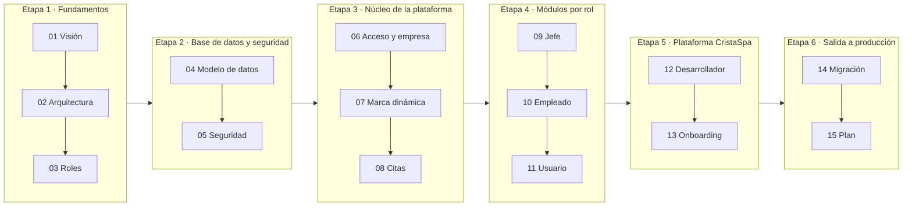

# CristaSpa — Flujos de diseño (v2 multiempresa)

> **Estado:** ✅ Flujos 01–15 aprobados el 2026-09-25. Implementación en curso en la rama `feature/cristaspa-v2`.
> **Fecha:** 2026-09-25
> **Origen:** evolución de la demo *Maison Lash* (v1) a la plataforma genérica **CristaSpa** (v2).

## Objetivo en una frase

Convertir la app de una sola marca (Maison Lash) en **CristaSpa**, una plataforma donde cada empresa (spa, salón, estudio de pestañas, barbería…) tiene sus datos aislados e identificados por `empresa_id`, con su propia marca, y un **módulo desarrollador** exclusivo para administrar todas las empresas y dar de alta nuevas.

## Índice y control de revisión

Los flujos están numerados **en el orden en que se revisan y se construyen**. Cada flujo se apoya solo en los anteriores, así que un flujo aprobado no se vuelve a abrir por culpa de uno posterior.

Estados: ⬜ pendiente · 🟡 en revisión · ✅ aprobado · 🔁 con cambios solicitados

| # | Etapa | Flujo | Qué define | Fase del plan | Estado |
|---|---|---|---|---|---|
| 01 | 1 · Fundamentos | [Visión y alcance](01-vision-y-alcance.md) | Problema actual, objetivos, alcance, métricas | — | ✅ |
| 02 | 1 · Fundamentos | [Arquitectura](02-arquitectura.md) | Decisión multiempresa, capas, carpetas, entornos | F0 | ✅ |
| 03 | 1 · Fundamentos | [Roles y permisos](03-roles-y-permisos.md) | Qué puede hacer cada rol y dónde se hace cumplir | F1 | ✅ |
| 04 | 2 · Datos y seguridad | [Modelo de datos](04-modelo-de-datos.md) | Tablas, `empresa_id`, RLS, RPC, índices, Storage | F1 | ✅ |
| 05 | 2 · Datos y seguridad | [Seguridad](05-seguridad.md) | Amenazas, controles, Ley 1581, checklist | F1 · F9 | ✅ |
| 06 | 3 · Núcleo | [Acceso y resolución de empresa](06-flujo-acceso-y-empresa.md) | Slug, login, registro, invitaciones, sesión | F2 | ✅ |
| 07 | 3 · Núcleo | [Marca dinámica](07-marca-dinamica.md) | Tokens de diseño, logo y colores por empresa, rebranding | F4 | ✅ |
| 08 | 3 · Núcleo | [Flujo de citas](08-flujo-citas.md) | Estados, disponibilidad, concurrencia, tiempo real | F1 · F5 | ✅ |
| 09 | 4 · Módulos | [Módulo jefe](09-modulo-jefe.md) | Agenda, catálogo, equipo, clientes, mi empresa, reportes | F5 | ✅ |
| 10 | 4 · Módulos | [Módulo empleado](10-modulo-empleado.md) | Agenda del especialista, estados, ausencias | F5 | ✅ |
| 11 | 4 · Módulos | [Módulo usuario](11-modulo-usuario.md) | Reserva, mis citas, productos, perfil | F5 | ✅ |
| 12 | 5 · Plataforma | [Módulo desarrollador](12-modulo-desarrollador.md) | Vista global, empresas, estados, "ver como", auditoría | F6 | ✅ |
| 13 | 5 · Plataforma | [Onboarding de empresas](13-onboarding-empresas.md) | Alta de una empresa nueva de punta a punta | F7 | ✅ |
| 14 | 6 · Salida | [Migración de Maison Lash](14-migracion-maison-lash.md) | Paso de los datos v1 a la empresa `maison-lash` | F8 | ✅ |
| 15 | 6 · Salida | [Plan de implementación](15-plan-de-implementacion.md) | Fases, criterios de aceptación, pruebas, corte | F0–F10 | ✅ |

### Cómo revisamos

1. Se revisa **un flujo a la vez**, en el orden de la tabla.
2. Por cada flujo: lo lees → comentas cambios → los aplico → lo marcas ✅.
3. Las decisiones D1–D8 se aprueban dentro del flujo donde aparecen (D1, D4 y D8 en el 02; D5, D6 y D7 en el 04; D2 y D3 en el 06).
4. Con toda la Etapa 1 y 2 aprobadas ya se puede empezar a programar las fases F0 y F1, sin esperar al resto.

## Decisiones que necesitan tu aprobación

Marca cada una con ✅ (aprobada) o escribe el cambio que quieras. **Todas aprobadas el 2026-09-25.**

| ID | Decisión propuesta | Alternativa | Detalle |
|---|---|---|---|
| D1 ✅ | **Una sola base Supabase compartida, aislada con `empresa_id` + RLS** | Un proyecto Supabase por empresa | [02](02-arquitectura.md#adr-001) |
| D2 ✅ | **Identificar la empresa por enlace `cristaspa.app/?empresa=slug`** (fase 1), subdominios `slug.cristaspa.app` después | Código de empresa escrito a mano en el login | [06](06-flujo-acceso-y-empresa.md) |
| D3 ✅ | **Supabase Auth con correo + contraseña** para todos los roles (se eliminan las contraseñas guardadas en tablas) | Enlace mágico / OTP | [06](06-flujo-acceso-y-empresa.md) |
| D4 ✅ | **Mantener HTML/CSS/JS sin framework**, pasando a módulos ES (`type="module"`), sin paso de compilación | Migrar a Vite + framework | [02](02-arquitectura.md#adr-003) |
| D5 ✅ | **Esquema v2 nuevo en español y snake_case** (`empresas`, `servicios`, `citas`…) con migración desde las tablas v1 | Conservar tablas v1 y solo agregar `empresa_id` | [04](04-modelo-de-datos.md) |
| D6 ✅ | **Categorías, horarios y duración de servicios configurables por empresa** (hoy están fijos: pestañas/cejas/labios, 7 horarios de 1 h) | Mantenerlos fijos | [04](04-modelo-de-datos.md), [08](08-flujo-citas.md) |
| D7 ✅ | **Imágenes en Supabase Storage** por carpeta de empresa (hoy se guardan en base64 dentro de la tabla) | Seguir en base64 | [04](04-modelo-de-datos.md#almacenamiento) |
| D8 ✅ | **Supabase es la fuente de verdad**; `localStorage` solo para la sesión y preferencias | Mantener localStorage como almacenamiento principal | [02](02-arquitectura.md#adr-004) |

## Glosario

| Término | Significado |
|---|---|
| **Empresa / tenant** | Negocio cliente de CristaSpa. Sus datos se identifican por `empresa_id`. |
| **`empresa_id`** | UUID de la empresa. Todas las tablas de negocio lo llevan. |
| **Slug** | Identificador legible y único de la empresa en la URL (`maison-lash`). |
| **Desarrollador** | Rol global del equipo CristaSpa. No pertenece a ninguna empresa y las ve todas. |
| **Jefe** | Dueño o administrador de *una* empresa. |
| **Empleado** | Especialista de una empresa que atiende citas. |
| **Usuario** | Cliente final que reserva citas en una empresa. |
| **RLS** | *Row Level Security* de Postgres: filtra las filas en la base de datos según quién consulta. |
| **Edge Function** | Función de servidor de Supabase. Ejecuta operaciones privilegiadas sin exponer secretos al navegador. |

## Cómo leer los diagramas

Los diagramas están en **Mermaid**. GitHub los muestra automáticamente. En VS Code se necesita la extensión *Markdown Preview Mermaid Support*.
